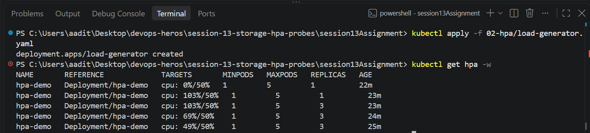
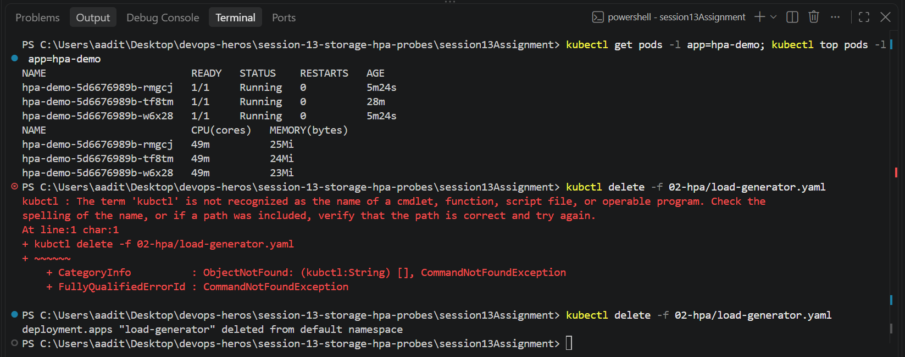
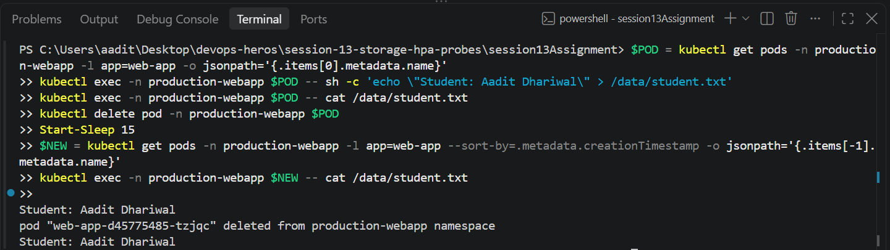
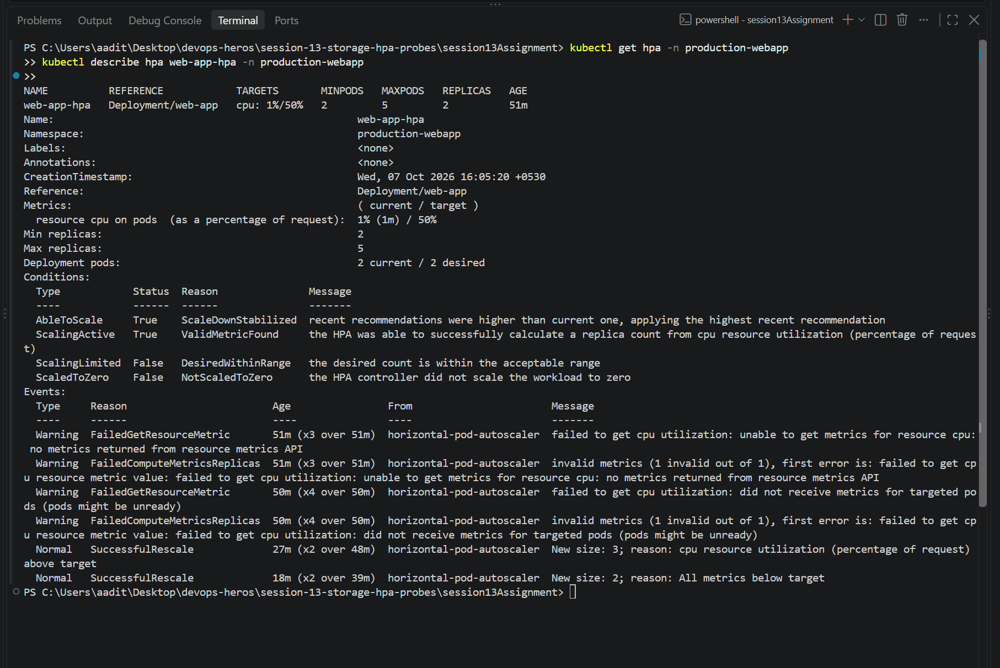

Session 13 - Storage, HPA and Probes

Task 1 (volumes notes) is in 01-kubernetes-volumes/README.md. Tasks 2 and 3 below.
Ran everything on minikube with `minikube addons enable metrics-server`.
Full raw output is in 02-hpa/hpa-output.txt and 03-mini-project/mini-project-output.txt.

---

## Task 2: HPA

Used the hpa-demo from 04-hpa (nginx, cpu request 100m, HPA min 1 max 5, target 50%).
Files are in 02-hpa/. Wrote load-generator.yaml myself - busybox pods running wget in a loop.

Before load:

```
$ kubectl get hpa
NAME       REFERENCE             TARGETS       MINPODS   MAXPODS   REPLICAS   AGE
hpa-demo   Deployment/hpa-demo   cpu: 0%/50%   1         5         1          119s

$ kubectl top pods -l app=hpa-demo
NAME                        CPU(cores)   MEMORY(bytes)
hpa-demo-5d6676989b-tf8tm   0m           21Mi
```

First it said `cpu: <unknown>/50%` and `kubectl top` gave "Metrics API not available" - just
had to wait a couple of minutes after enabling metrics-server.

Started with 3 load pods, only got to 41%, so it never scaled. Bumped it to 8:

```
$ kubectl get hpa -w
NAME       REFERENCE             TARGETS         MINPODS   MAXPODS   REPLICAS   AGE
hpa-demo   Deployment/hpa-demo   cpu: 0%/50%     1         5         1          119s
hpa-demo   Deployment/hpa-demo   cpu: 41%/50%    1         5         1          2m30s   <- 3 load pods
hpa-demo   Deployment/hpa-demo   cpu: 115%/50%   1         5         1          3m31s   <- 8 load pods
hpa-demo   Deployment/hpa-demo   cpu: 115%/50%   1         5         3          3m46s   <- scaled to 3
hpa-demo   Deployment/hpa-demo   cpu: 53%/50%    1         5         3          4m31s
hpa-demo   Deployment/hpa-demo   cpu: 48%/50%    1         5         3          5m31s

$ kubectl get pods -l app=hpa-demo
NAME                        READY   STATUS    RESTARTS   AGE
hpa-demo-5d6676989b-6gq89   1/1     Running   0          6m15s
hpa-demo-5d6676989b-kshvt   1/1     Running   0          6m15s
hpa-demo-5d6676989b-tf8tm   1/1     Running   0          9m46s

$ kubectl top pods -l app=hpa-demo
NAME                        CPU(cores)   MEMORY(bytes)
hpa-demo-5d6676989b-6gq89   49m          24Mi
hpa-demo-5d6676989b-kshvt   49m          23Mi
hpa-demo-5d6676989b-tf8tm   49m          23Mi

$ kubectl describe hpa hpa-demo
  resource cpu on pods  (as a percentage of request):  49% (49m) / 50%
Deployment pods:                                       3 current / 3 desired
  Normal   SuccessfulRescale   6m16s   horizontal-pod-autoscaler  New size: 3; reason: cpu resource utilization (percentage of request) above target
```




115% on 1 pod -> it jumped straight to 3, not 2. The math is ceil(1 * 115/50) = 3.
Then the same load spread over 3 pods = ~49% each, under 50%, so it stopped there and didn't go to 5.

Deleted the load generator and watched it go back down:

```
hpa-demo   Deployment/hpa-demo   cpu: 0%/50%    1         5         3          11m
hpa-demo   Deployment/hpa-demo   cpu: 0%/50%    1         5         3          16m
hpa-demo   Deployment/hpa-demo   cpu: 0%/50%    1         5         1          16m
```

Scale up took ~15 sec, scale down waited ~5 min at 0% before removing pods.

## Task 3: Mini project

Files from mini-project/ in 03-mini-project/: namespace, 500Mi PVC, deployment with
startup/readiness/liveness probes mounting the PVC at /data, service, HPA (min 2 max 5).

```
$ kubectl get pvc,pods,svc,hpa -n production-webapp
NAME                             STATUS   VOLUME                                     CAPACITY   STORAGECLASS
persistentvolumeclaim/web-data   Bound    pvc-5673a462-6fda-4ac6-9f66-56f1d93f1eca   500Mi      standard

NAME                          READY   STATUS    RESTARTS   AGE
pod/web-app-d45775485-2mzjf   1/1     Running   0          18s
pod/web-app-d45775485-tzjqc   1/1     Running   0          18s

NAME                  TYPE        CLUSTER-IP    PORT(S)
service/web-service   ClusterIP   10.102.29.3   80/TCP

NAME                                              REFERENCE            TARGETS              MINPODS   MAXPODS   REPLICAS
horizontalpodautoscaler.autoscaling/web-app-hpa   Deployment/web-app   cpu: <unknown>/50%   2         5         2
```

Storage test - wrote a file, deleted that pod, read it from the new pod:

```
$ kubectl exec -n production-webapp web-app-d45775485-2mzjf -- sh -c 'echo "Student: Aadit Dhariwal" > /data/student.txt'
$ kubectl delete pod -n production-webapp web-app-d45775485-2mzjf
$ kubectl exec -n production-webapp web-app-d45775485-khl64 -- cat /data/student.txt   (new pod)
Student: Aadit Dhariwal
```



Service:

```
$ kubectl port-forward -n production-webapp svc/web-service 8080:80
$ curl -s http://localhost:8080 | head -4
<!DOCTYPE html>
<html>
<head>
<title>Welcome to nginx!</title>
```

HPA - the readme says one `kubectl run` busybox, but from task 2 I knew that's not enough
load, so I used a load-generator deployment with 10 replicas:

```
$ kubectl get hpa -n production-webapp -w
NAME          REFERENCE            TARGETS              MINPODS   MAXPODS   REPLICAS   AGE
web-app-hpa   Deployment/web-app   cpu: <unknown>/50%   2         5         2          47s
web-app-hpa   Deployment/web-app   cpu: 45%/50%         2         5         2          105s
web-app-hpa   Deployment/web-app   cpu: 70%/50%         2         5         2          2m46s
web-app-hpa   Deployment/web-app   cpu: 70%/50%         2         5         3          3m1s
web-app-hpa   Deployment/web-app   cpu: 59%/50%         2         5         3          3m46s
web-app-hpa   Deployment/web-app   cpu: 48%/50%         2         5         3          4m46s
```



Probes on the pods:

```
    Restart Count:  0
    Liveness:     http-get http://:80/ delay=5s timeout=2s period=5s #success=1 #failure=3
    Readiness:    http-get http://:80/ delay=5s timeout=2s period=5s #success=1 #failure=2
    Startup:      http-get http://:80/ delay=0s timeout=1s period=2s #success=1 #failure=30
      /data from persistent-storage (rw)
```

Startup probe gives it up to 60s (30 x 2s) to boot before liveness starts checking.
Readiness fail = removed from service, liveness fail = container restarted.

---

What I learned:

HPA needs metrics-server AND a cpu request on the container, because the % is of the
request, not of the node. It scales to whatever brings the average under the target, so
mine stopped at 3 not 5. Scale down is slow on purpose (5 min) so it doesn't flap.
The PVC is RWO but 3 pods could still share it - RWO means one node, and minikube only has one.
