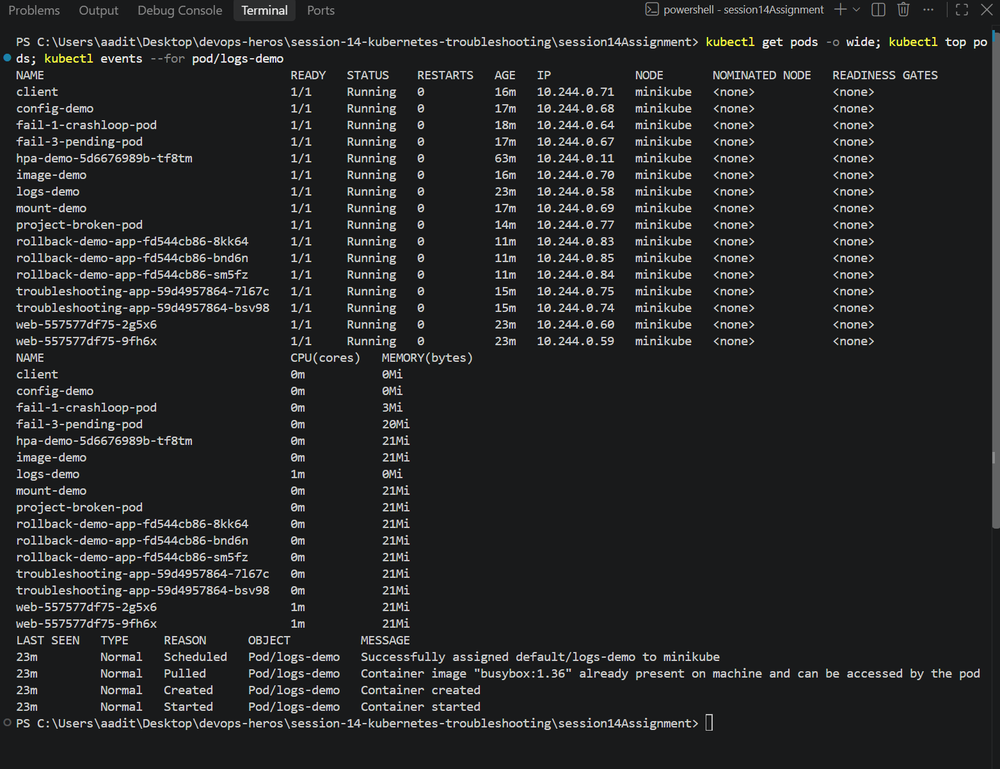
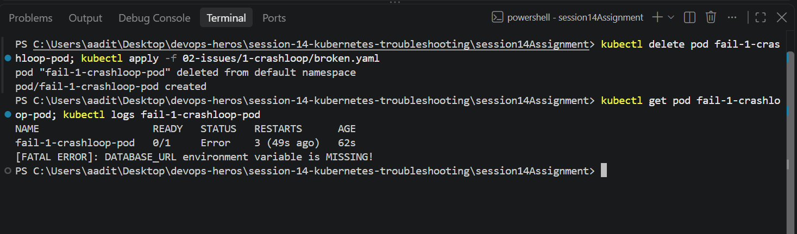
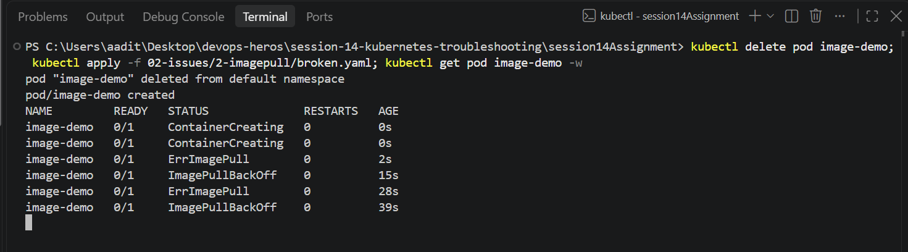
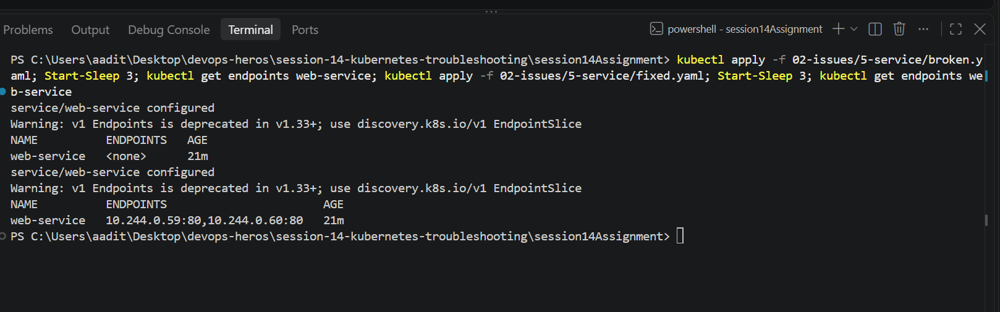
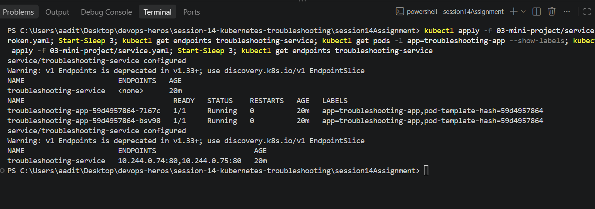

Session 14 - Kubernetes Troubleshooting

Practiced the debug commands, then broke things on purpose and fixed them, then did the
mini project. Everything on minikube. Full raw output is in the output.txt in each folder,
below is the short version.

---

## Task 1: Commands

Ran a logs-demo pod and the `web` deployment and tried every command on them.
All output in 01-commands/output.txt.

| command | what it's for |
| --- | --- |
| `kubectl get pods` | quick status - Running / Pending / CrashLoopBackOff, restarts |
| `kubectl get pods -o wide` | same + pod IP and node |
| `kubectl describe pod` | full details, and the **Events** at the bottom which is where most errors are |
| `kubectl logs` | what the app printed (`--previous` for the crashed one, `deploy/web` works too) |
| `kubectl exec` | run a command inside the container - curl, cat a file, check env |
| `kubectl events --for pod/x` | just the events for one thing |
| `kubectl explain` | docs for any yaml field, no googling |
| `kubectl top` | cpu/memory, needs metrics-server |

```
$ kubectl get pods -o wide
NAME                        READY   STATUS    RESTARTS   AGE   IP            NODE
logs-demo                   1/1     Running   0          8s    10.244.0.58   minikube
web-557577df75-2g5x6        1/1     Running   0          8s    10.244.0.60   minikube
web-557577df75-9fh6x        1/1     Running   0          8s    10.244.0.59   minikube

$ kubectl logs logs-demo --tail=4
Database connection successful
Application is running
Application is healthy
Application is healthy

$ kubectl exec logs-demo -- cat /etc/resolv.conf
search default.svc.cluster.local svc.cluster.local cluster.local
nameserver 10.96.0.10

$ kubectl exec web-557577df75-2g5x6 -- curl -s -o /dev/null -w "%{http_code}" localhost
200

$ kubectl events --for pod/logs-demo
LAST SEEN   TYPE     REASON      OBJECT          MESSAGE
9s          Normal   Scheduled   Pod/logs-demo   Successfully assigned default/logs-demo to minikube
8s          Normal   Started     Pod/logs-demo   Container started

$ kubectl explain pod.spec.containers.livenessProbe
FIELD: livenessProbe <Probe>
DESCRIPTION:
    Periodic probe of container liveness. Container will be restarted if the
    probe fails. Cannot be updated.

$ kubectl top pods
NAME                   CPU(cores)   MEMORY(bytes)
logs-demo              1m           0Mi
web-557577df75-2g5x6   2m           21Mi
```



Funny one: `kubectl get deploy,rs,pods -l app=web` didn't show the deployment, because the
`app: web` label is only on the pod template, not on the Deployment itself.

## Task 2: Troubleshooting

Each folder in 02-issues/ has broken.yaml, fixed.yaml and output.txt. For pods I had to
delete and re-apply, because you can't edit most of a running pod's spec.

**1. CrashLoopBackOff** (1-crashloop)

```
$ kubectl get pod fail-1-crashloop-pod
NAME                   READY   STATUS             RESTARTS      AGE
fail-1-crashloop-pod   0/1     CrashLoopBackOff   4 (68s ago)   2m29s
$ kubectl describe pod ...      Last State: Terminated  Reason: Error  Exit Code: 1
$ kubectl logs fail-1-crashloop-pod
[FATAL ERROR]: DATABASE_URL environment variable is MISSING!
```

Root cause: app exits 1 because env var DATABASE_URL isn't set. Fix: add it under `env:`.
After: `Running 0 restarts`, logs say `Application started successfully!`.
(Also had to add `python3 -u` - without it the print was buffered and logs were empty.)
In my screenshot the status says `Error` instead - it flips between Error (just crashed) and
CrashLoopBackOff (waiting to restart), same idea as ErrImagePull / ImagePullBackOff.



**2. ErrImagePull / ImagePullBackOff** (2-imagepull)

```
$ kubectl get pod image-demo -w
image-demo   0/1     ContainerCreating   0          0s
image-demo   0/1     ErrImagePull        0          2s
image-demo   0/1     ImagePullBackOff    0          13s
image-demo   0/1     ErrImagePull        0          34s
Events: Failed to pull image "nginx:this-image-does-not-exist": ... not found
```

ErrImagePull is the actual failure, ImagePullBackOff is k8s waiting before it tries again -
it keeps flipping between the two. Root cause: tag doesn't exist. Fix: `nginx:1.27`. After: Running.



**3. Pending** (3-pending)

```
$ kubectl get pod fail-3-pending-pod
fail-3-pending-pod   0/1     Pending   0          10s
Events: FailedScheduling  0/1 nodes are available: 1 Insufficient cpu, 1 Insufficient memory.
$ kubectl describe node minikube   ->  Allocatable: cpu 28, memory 7977668Ki
```

Root cause: pod requests 500 CPU and 1000Gi RAM, node only has 28 CPU / ~8Gi. No node fits so
the scheduler never places it - no logs because it never started. Fix: request 100m / 64Mi. After: Running.

**4. ContainerCreating** (4-containercreating)

```
$ kubectl get pod mount-demo
mount-demo   0/1     ContainerCreating   0          30s
Events: FailedMount  MountVolume.SetUp failed for volume "settings" : configmap "app-settings" not found
```

Root cause: pod mounts a configmap that doesn't exist, so it gets stuck before the container
starts. Fix: create the configmap. Didn't even need to recreate the pod, kubelet kept retrying
and it went Running by itself. `cat /etc/settings/mode` -> `demo`.

**5. Service connectivity** (5-service)

```
$ kubectl exec client -- wget -q -T 3 -O- http://web-service
wget: can't connect to remote host (10.97.134.98): Connection refused
$ kubectl get endpoints web-service
web-service   <none>
$ kubectl describe svc web-service      Selector: app=web-ahsgdf
$ kubectl get pods -l app=web --show-labels      app=web,...
```

Root cause: service selector `app=web-ahsgdf` doesn't match the pod label `app=web`, so 0 endpoints.
Fix: selector `app: web`. After: endpoints `10.244.0.59:80,10.244.0.60:80` and wget gets the nginx page.



**6. DNS** (6-dns)

```
$ kubectl logs dns-client -n other
wget: bad address 'web-service'
$ kubectl exec -n other dns-client -- nslookup web-service
** server can't find web-service.other.svc.cluster.local: NXDOMAIN
$ kubectl get svc -A --field-selector metadata.name=web-service
default             web-service   ...
$ kubectl exec -n other dns-client -- nslookup web-service.default.svc.cluster.local
Name:	web-service.default.svc.cluster.local
Address: 10.97.134.98
```

Root cause: client pod is in namespace `other`, service is in `default`. The short name only
searches your own namespace (you can see it in resolv.conf: `search other.svc.cluster.local ...`).
Fix: use `web-service.default.svc.cluster.local`. After: logs print `OK`.

**7. Pod networking / wrong port** (7-networking)

```
$ kubectl exec client -- wget -q -T 3 -O- http://web-port-svc
wget: can't connect to remote host (10.96.121.181): Connection refused
$ kubectl get endpoints web-port-svc
web-port-svc   10.244.0.59:8080,10.244.0.60:8080
$ kubectl exec client -- wget -q -T 3 -O- http://10.244.0.60:8080   -> Connection refused
$ kubectl exec client -- wget -q -T 3 -O- http://10.244.0.60:80     -> <title>Welcome to nginx!</title>
```

Endpoints exist this time so the selector is fine. Hitting the pod IP directly on 80 works, so
pod-to-pod networking is fine too - it's the port. Root cause: `targetPort: 8080` but nginx
listens on 80. Fix: targetPort 80. After: service returns the nginx page.

**8. Configuration issue** (8-config)

```
$ kubectl get pod config-demo
config-demo   0/1     CreateContainerConfigError   0          15s
Events: Error: configmap "app-config" not found
```

Root cause: env var reads from a configmap key that was never created. Fix: create the
configmap. After: Running, logs `LOG_LEVEL=debug`.

## Task 3: Mini project

Files in 03-mini-project/. Deployed the nginx app (2 pods) + troubleshooting-service, checked
it was healthy, then did the broken pod and the wrong selector. Output in 03-mini-project/output.txt.

```
$ kubectl get endpoints troubleshooting-service
troubleshooting-service   10.244.0.74:80,10.244.0.75:80
$ kubectl exec troubleshooting-app-59d4957864-7l67c -- curl -s localhost | grep title
<title>Welcome to nginx!</title>

$ kubectl get pod project-broken-pod
project-broken-pod   0/1     ImagePullBackOff   0          25s
Events: Failed to pull image "nginx:this-tag-does-not-exist": ... not found

(service-broken.yaml - selector app: wrong-app)
$ kubectl get endpoints troubleshooting-service
troubleshooting-service   <none>
$ kubectl describe service troubleshooting-service      Selector: app=wrong-app
$ kubectl get pods --show-labels                         app=troubleshooting-app

(after fix)
$ kubectl get endpoints troubleshooting-service
troubleshooting-service   10.244.0.74:80,10.244.0.75:80
$ kubectl exec client -- wget -q -T 3 -O- http://troubleshooting-service | grep title
<title>Welcome to nginx!</title>
```



Broken pod questions:
1. Status - `ImagePullBackOff` (flips with `ErrImagePull`)
2. Actual error - `docker.io/library/nginx:this-tag-does-not-exist: not found`
3. Command - `kubectl describe pod project-broken-pod`, the Events part
4. Image problem - nginx is fine, the tag `this-tag-does-not-exist` doesn't exist on Docker Hub
5. Fix - use a real tag like `nginx:1.27` (broken-pod-fixed.yaml), delete and re-apply

| Problem | What I saw | Command I used | Root cause | Fix |
| --- | --- | --- | --- | --- |
| Broken pod | 0/1 ImagePullBackOff | describe pod -> Events | image tag doesn't exist | nginx:1.27 |
| Service problem | endpoints `<none>` | get endpoints, get pods --show-labels | selector app=wrong-app != label | selector back to troubleshooting-app |
| Image problem | ErrImagePull "not found" | describe pod | bad tag on Docker Hub | fix tag, re-apply |

README questions:
1. `kubectl get` - quick list and status of resources.
2. get vs describe - get is one line per thing, describe is everything about one thing + events.
3. logs - see what the app itself printed, mostly why it crashed.
4. exec - when the pod is running but something's off, to test from inside (curl, env, files).
5. CrashLoopBackOff - container keeps starting and dying, k8s waits longer between each restart.
6. ImagePullBackOff - can't pull the image (wrong name/tag/private repo), waiting before retrying.
7. Pending - no node can take it: not enough cpu/memory, nodeSelector doesn't match, PVC not bound.
8. No endpoints - selector doesn't match any pod labels, or the matching pods aren't Ready.
9. Selector vs labels - service sends traffic to any pod whose labels match its selector. That's the only link.
10. Kubernetes DNS - CoreDNS gives every service a name `<svc>.<namespace>.svc.cluster.local`.

---

What I learned: always go get -> describe -> logs before touching yaml, the Events section
basically tells you the answer most of the time. The status name tells you which stage
broke (Pending = scheduling, ContainerCreating = image/volumes, CrashLoop = the app itself).
And for service problems, endpoints `<none>` is the first thing to check.
