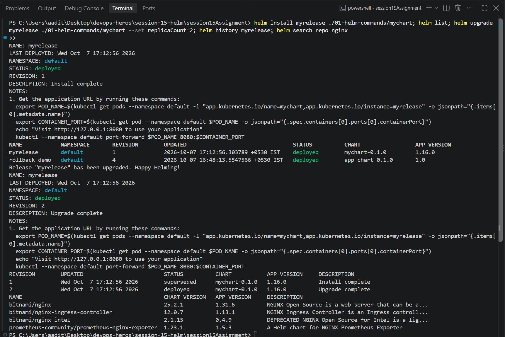

Task 1 - Helm commands

Installed helm with `winget install Helm.Helm` (got v4.3.0). Made a chart with helm create and
ran every command on it. Full output in output.txt.

helm create - makes a starter chart folder.

```
$ helm create mychart
Creating mychart
mychart/Chart.yaml  values.yaml  templates/deployment.yaml service.yaml ingress.yaml hpa.yaml ...
$ helm lint mychart
1 chart(s) linted, 0 chart(s) failed
```

helm install - render the templates with values and apply them. That's called a "release".

```
$ helm install myrelease ./mychart
NAME: myrelease
STATUS: deployed
REVISION: 1
```

helm list - all releases. helm status - one release + the k8s resources it made.

```
$ helm list
NAME       NAMESPACE  REVISION  STATUS    CHART          APP VERSION
myrelease  default    1         deployed  mychart-0.1.0  1.16.0

$ helm status myrelease
==> v1/Service
myrelease-mychart   ClusterIP   10.110.154.85   <none>   80/TCP   11s
==> v1/Deployment
myrelease-mychart   1/1     1            1           11s
```

helm get - what's stored for the release. `values` = what I passed, `--all` = everything incl
defaults, `manifest` = the final yaml that went to k8s.

```
$ helm get values myrelease
USER-SUPPLIED VALUES:
null
$ helm get manifest myrelease | head
# Source: mychart/templates/serviceaccount.yaml
apiVersion: v1
kind: ServiceAccount
...
```

helm upgrade - change a running release. helm history - every revision.

```
$ helm upgrade myrelease ./mychart --set replicaCount=2
Release "myrelease" has been upgraded. Happy Helming!
REVISION: 2
$ helm get values myrelease
USER-SUPPLIED VALUES:
replicaCount: 2
$ helm history myrelease
REVISION  STATUS      DESCRIPTION
1         superseded  Install complete
2         deployed    Upgrade complete
```

helm rollback - go back to an old revision. It makes a new revision (3), it doesn't delete 2.

```
$ helm rollback myrelease 1
Rollback was a success! Happy Helming!
$ helm history myrelease
1         superseded  Install complete
2         superseded  Upgrade complete
3         deployed    Rollback to 1
$ kubectl get pods -l app.kubernetes.io/instance=myrelease
myrelease-mychart-5fdbfd9b94-k6mtq   1/1     Running   0          18s     <- back to 1 pod
```

helm uninstall - deletes everything the release made.

```
$ helm uninstall myrelease
release "myrelease" uninstalled
```

helm repo / helm search - repos are like apt sources for charts. `search repo` searches the
repos I added, `search hub` searches Artifact Hub online.

```
$ helm repo add bitnami https://charts.bitnami.com/bitnami
$ helm repo add prometheus-community https://prometheus-community.github.io/helm-charts
$ helm repo update
Update Complete. ⎈Happy Helming!⎈
$ helm search repo nginx
bitnami/nginx                                   25.2.1   1.31.6   NGINX Open Source is a web server...
prometheus-community/prometheus-nginx-exporter  1.23.1   1.5.3    A Helm chart for NGINX Prometheus Exporter
$ helm search hub wordpress
https://artifacthub.io/packages/helm/slybase-wo...   5.5.40   7.0.1   Using the official WordPress image...
```



What I learned: a chart is just templates + values, and a release is one install of it. Helm
remembers every revision, which is what makes rollback a one-liner.
