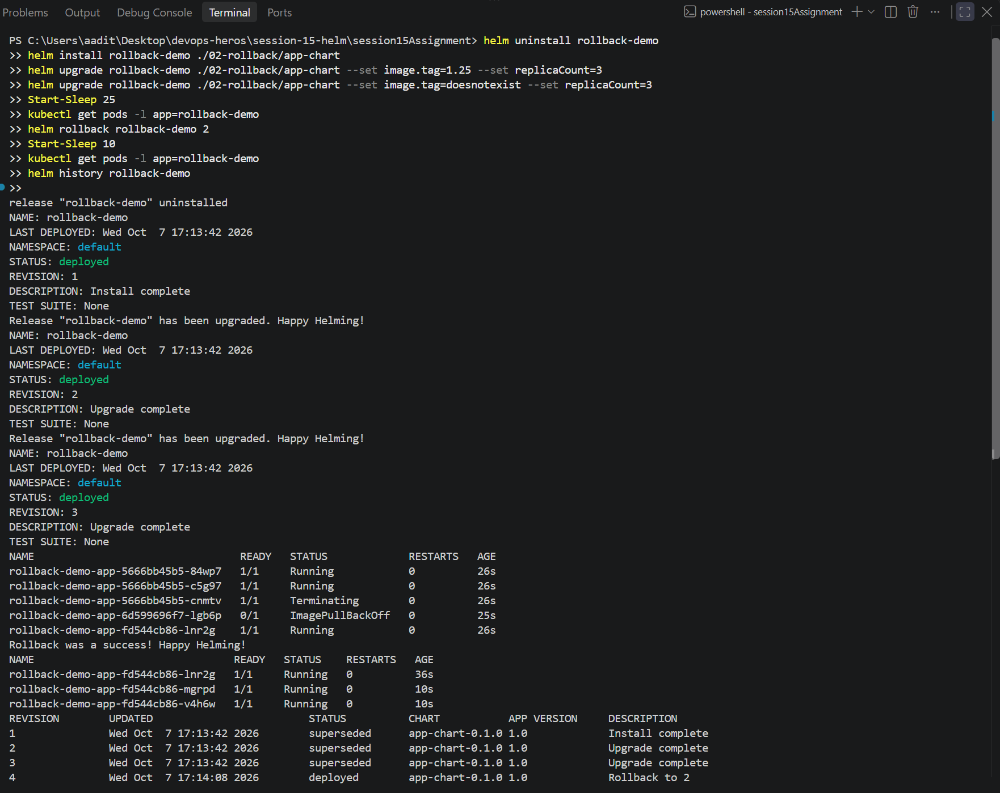

Task 2 - Helm rollback

Used app-chart from 07-install-upgrade (nginx deployment, image tag + replicas in values).
Install -> upgrade -> verify -> bad upgrade -> verify -> rollback -> verify. Output in output.txt.

```
1. install
$ helm install rollback-demo ./app-chart
REVISION: 1
$ kubectl get deploy rollback-demo-app -o jsonpath="{...image}"
nginx:1.24

2. upgrade - newer nginx, 3 replicas
$ helm upgrade rollback-demo ./app-chart --set image.tag=1.25 --set replicaCount=3
REVISION: 2

3. verify
$ kubectl get pods -l app=rollback-demo
rollback-demo-app-fd544cb86-8kk64    1/1     Running       0          15s
rollback-demo-app-fd544cb86-bnd6n    1/1     Running       0          0s
rollback-demo-app-fd544cb86-sm5fz    1/1     Running       0          1s
image: nginx:1.25

4. upgrade again - bad tag
$ helm upgrade rollback-demo ./app-chart --set image.tag=doesnotexist --set replicaCount=3
Release "rollback-demo" has been upgraded. Happy Helming!
REVISION: 3

5. verify
$ kubectl get pods -l app=rollback-demo
rollback-demo-app-6d599696f7-4nt79   0/1     ErrImagePull   0          30s
rollback-demo-app-fd544cb86-8kk64    1/1     Running        0          46s
rollback-demo-app-fd544cb86-bnd6n    1/1     Running        0          31s
rollback-demo-app-fd544cb86-sm5fz    1/1     Running        0          32s
image: nginx:doesnotexist

6. rollback to 2
$ helm rollback rollback-demo 2
Rollback was a success! Happy Helming!

7. verify
$ kubectl get pods -l app=rollback-demo
rollback-demo-app-fd544cb86-8kk64   1/1     Running   0          51s
rollback-demo-app-fd544cb86-bnd6n   1/1     Running   0          36s
rollback-demo-app-fd544cb86-sm5fz   1/1     Running   0          37s
image: nginx:1.25

$ helm history rollback-demo
REVISION  STATUS      DESCRIPTION
1         superseded  Install complete
2         superseded  Upgrade complete
3         superseded  Upgrade complete
4         deployed    Rollback to 2
```



Two things I noticed:
- Helm said the bad upgrade was "deployed" and "Happy Helming!". Helm only checks that k8s
  accepted the yaml, not that pods came up. `helm upgrade --wait` (or `--atomic`) would catch it.
- The app never went down. The rolling update made 1 new pod first, it failed to pull, so k8s
  never killed the 3 old ones. After rollback the same 3 pods (same names) were still there.

What I learned: always check pods after an upgrade, not just the helm output. Rollback goes
back to the exact values of that revision and adds a new revision, so the history keeps everything.
