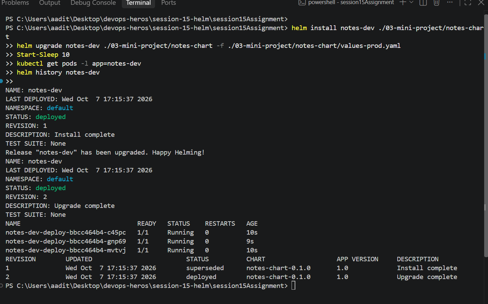

Task 3 - Mini project: notes-chart

Packaged the "notes app" (nginx) as a chart: Chart.yaml, values.yaml (dev), values-prod.yaml,
and templates for deployment, service (NodePort 30090) and configmap. Output in output.txt.

```
$ helm lint notes-chart
1 chart(s) linted, 0 chart(s) failed

$ helm template notes-dev notes-chart      (renders locally, nothing applied)
  name: notes-dev-config
  ENVIRONMENT: "development"
  image: "nginx:1.24"
  nodePort: 30090

$ helm install notes-dev notes-chart
STATUS: deployed
REVISION: 1
$ kubectl get pods -l app=notes-dev
notes-dev-deploy-74956bd987-k7c7f   1/1     Running   0          1s
$ kubectl exec deploy/notes-dev-deploy -- printenv ENVIRONMENT APP_NAME
development
notes-app

$ helm upgrade notes-dev notes-chart -f notes-chart/values-prod.yaml
REVISION: 2
$ kubectl get pods -l app=notes-dev
notes-dev-deploy-bbcc464b4-9n95b   1/1     Running   0          9s
notes-dev-deploy-bbcc464b4-gv26f   1/1     Running   0          10s
notes-dev-deploy-bbcc464b4-m88ww   1/1     Running   0          9s
image: nginx:1.25
$ kubectl exec deploy/notes-dev-deploy -- printenv ENVIRONMENT
production

$ helm upgrade notes-dev notes-chart -f notes-chart/values-prod.yaml --set image.tag=broken-tag-does-not-exist
REVISION: 3
$ kubectl get pods -l app=notes-dev
notes-dev-deploy-79b4dbdffd-h54g5   0/1     ErrImagePull   0          30s
notes-dev-deploy-bbcc464b4-9n95b    1/1     Running        0          40s
...

$ helm rollback notes-dev 2
Rollback was a success! Happy Helming!
$ kubectl get pods -l app=notes-dev
notes-dev-deploy-bbcc464b4-9n95b   1/1     Running   0          48s
notes-dev-deploy-bbcc464b4-gv26f   1/1     Running   0          49s
notes-dev-deploy-bbcc464b4-m88ww   1/1     Running   0          48s

$ helm history notes-dev
1   superseded  Install complete
2   superseded  Upgrade complete
3   superseded  Upgrade complete
4   deployed    Rollback to 2

$ helm uninstall notes-dev
release "notes-dev" uninstalled
$ kubectl get svc notes-dev-svc; kubectl get configmap notes-dev-config
Error from server (NotFound): services "notes-dev-svc" not found
Error from server (NotFound): configmaps "notes-dev-config" not found
```



Same chart, two values files = dev (1 pod, nginx 1.24, "development") and prod (3 pods,
nginx 1.25, "production"). Only the values changed, the templates stayed the same.
`{{ .Release.Name }}` in every name means I could install it twice (notes-dev, notes-prod)
without names clashing.

What I learned: `helm template` is really useful to check the yaml before installing. Configmap
values reach the pod as env vars through envFrom. And uninstall cleans up everything in one go,
no deleting things one by one.
