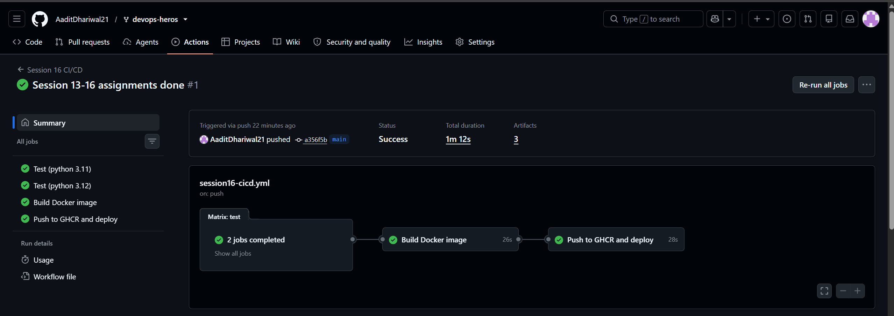
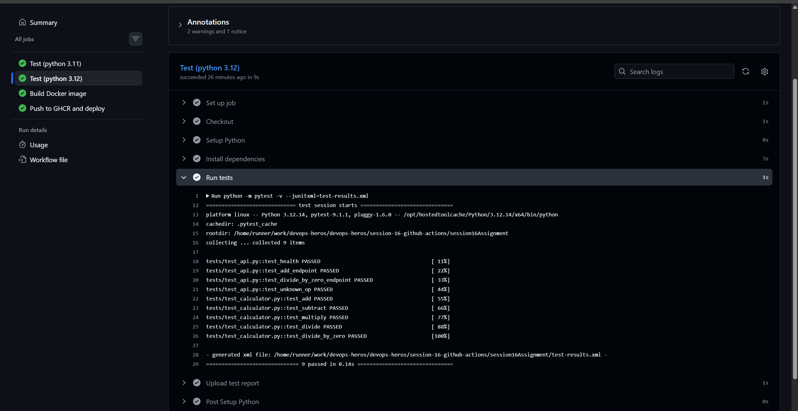
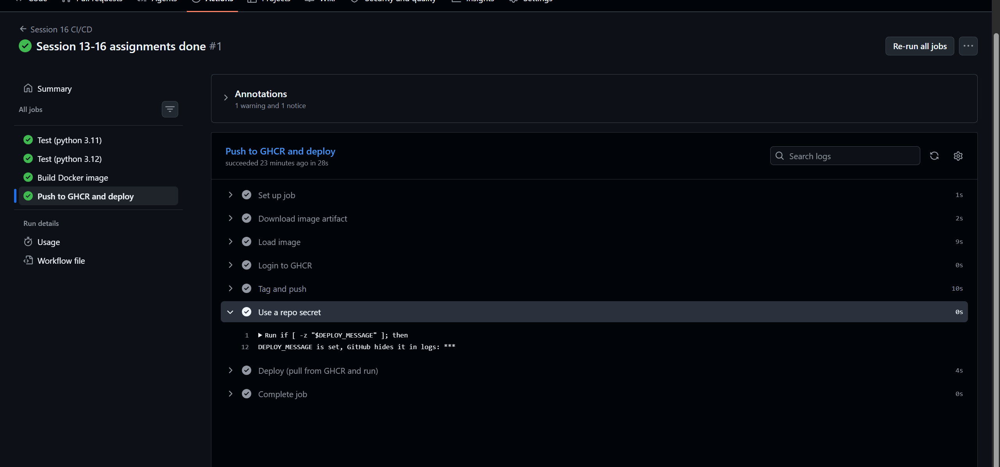
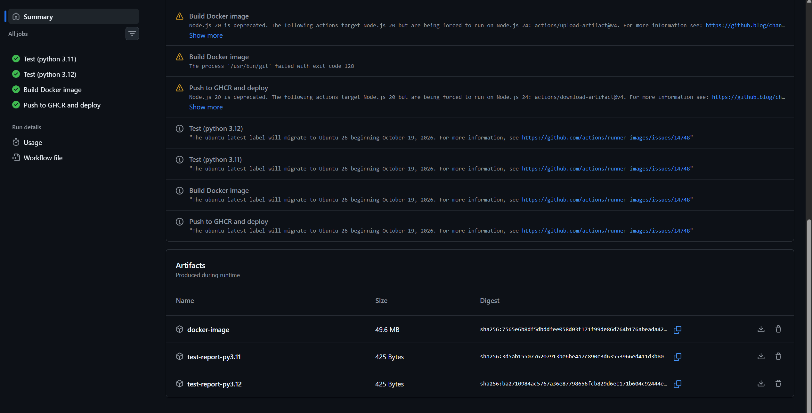

Session 16 - CI/CD with GitHub Actions

Made a small CI/CD demo based on 10-final-cicd-pipeline. App is the same calculator but as a
Flask API so it can go in a Docker image and actually be "deployed".

```
app/calculator.py    add / subtract / multiply / divide
app/main.py          flask - /health, /add/2/3, /divide/1/0 ...
tests/               9 pytest tests (functions + api)
Dockerfile           python:3.12-slim, runs the api on port 5000
```

Workflow: [.github/workflows/session16-cicd.yml](../../.github/workflows/session16-cicd.yml)

Important thing I found: GitHub only runs workflows from `.github/workflows/` at the **root** of
the repo. The `.github` folders inside the session-16 class folders never run. So I put mine at
the root with a `paths:` filter so it only runs when this folder changes, and
`working-directory` so the steps run inside this folder.

## CI vs CD

CI = every push gets tested and built automatically, so broken code is caught straight away.
CD = after CI passes, the build gets shipped somewhere automatically (here: pushed to GHCR and run).

## Pipeline

```
push to main
   |
 test (py 3.11) + test (py 3.12)   <- matrix, run in parallel      CI
   |
 build docker image + smoke test   <- needs: test                  CI
   |
 push to ghcr.io + deploy          <- needs: build, not on PRs     CD
```

- **Workflow** - the yml file. Triggers: push to main, pull_request, and workflow_dispatch (manual button).
- **Jobs** - test, build, deploy. Each one is a fresh VM, so `needs:` makes them go in order and
  the image is passed from build to deploy as an artifact.
- **Steps** - checkout, setup python, install, pytest, docker build... run top to bottom inside a job.
- **Runners** - `ubuntu-latest` hosted by GitHub. The matrix runs the test job on 2 runners at once.
- **Secrets** - `GITHUB_TOKEN` (GitHub gives it automatically) to log in to GHCR, and my own
  `DEPLOY_MESSAGE` secret to show that secrets are printed as `***` in logs.
- **Artifacts** - test-results.xml from each test job, and the docker image (image.tar.gz) from build.

## Ran it locally first

```
$ python -m pytest -v
tests/test_api.py::test_health PASSED
tests/test_api.py::test_add_endpoint PASSED
tests/test_api.py::test_divide_by_zero_endpoint PASSED
tests/test_api.py::test_unknown_op PASSED
tests/test_calculator.py::test_add PASSED
tests/test_calculator.py::test_subtract PASSED
tests/test_calculator.py::test_multiply PASSED
tests/test_calculator.py::test_divide PASSED
tests/test_calculator.py::test_divide_by_zero PASSED
9 passed in 0.21s

$ docker build -t session16-calculator:local .
$ docker run -d -p 5055:5000 --name s16test session16-calculator:local
$ curl localhost:5055/health
{"status":"ok"}
$ curl localhost:5055/add/2/3
{"result":5}
$ curl localhost:5055/divide/1/0
{"error":"Cannot divide by zero"}    (400)
```

## Pipeline execution on GitHub






What I learned: CI catches problems on every push without me remembering to run tests, and
`needs:` means a failed test stops the build and deploy. Each job is a new machine so nothing
carries over unless you upload it as an artifact. Secrets never show up in the logs.
