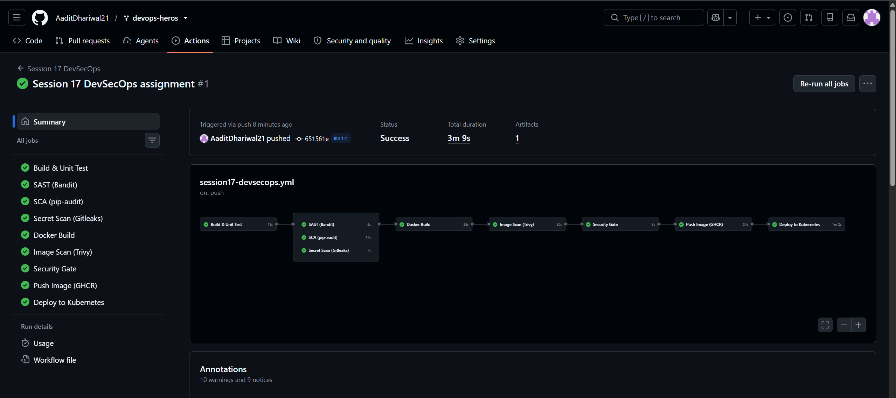
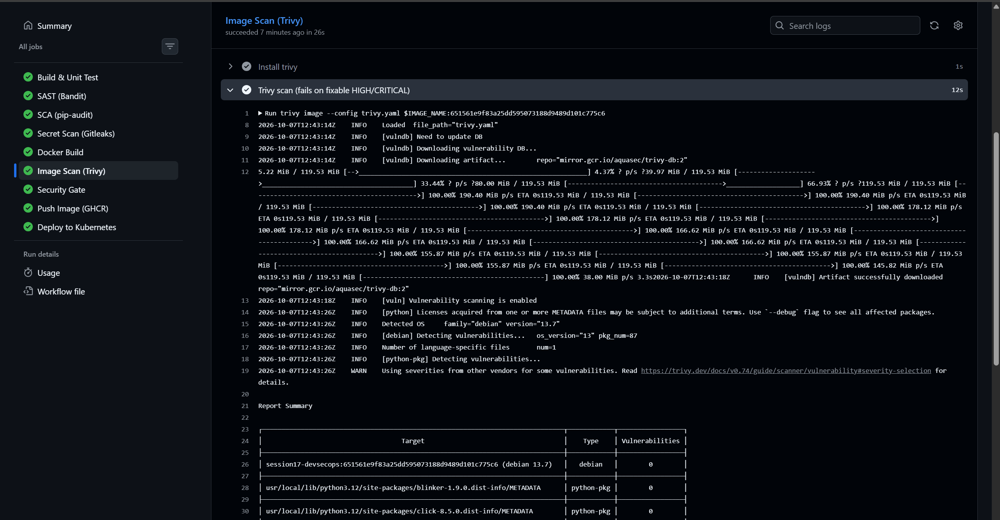
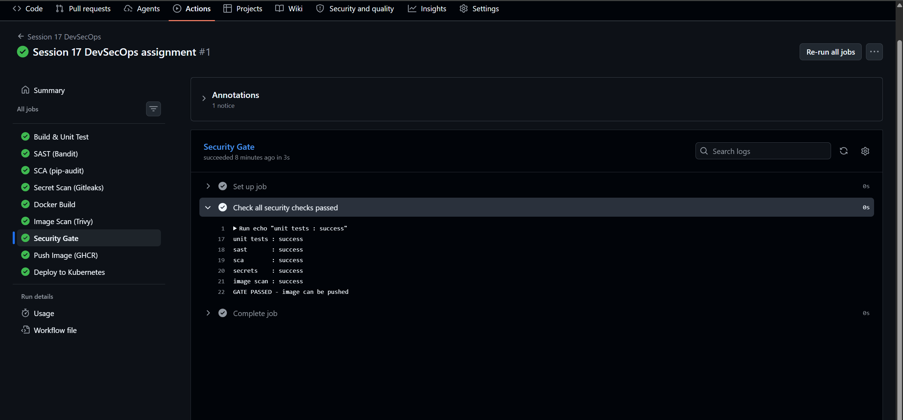
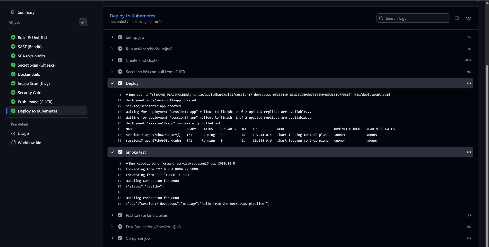

Session 17 - CI/CD + DevSecOps

Small Flask app with a full pipeline that tests it, runs 4 security scans, and only pushes and
deploys the image if every scan passes.

```
app/main.py           flask api - /, /health, /api/greet/<name>, POST /api/add
tests/test_app.py     5 pytest tests
Dockerfile            python:3.12-slim + gunicorn, runs as non-root, pip removed
k8s/                  deployment (2 replicas, probes, limits, non-root) + NodePort service
bandit.yaml           SAST config
.gitleaks.toml        secret scan config
trivy.yaml            image scan config (the image gate)
```

Workflow: [.github/workflows/session17-devsecops.yml](../../.github/workflows/session17-devsecops.yml)
(has to be at the repo root or GitHub won't run it, same as session 16)

## Pipeline

```
Build & Unit Test
      |
  +---+-----------------+
SAST (Bandit)   SCA (pip-audit)   Secret Scan (Gitleaks)     <- run in parallel
  +---+-----------------+
      |
Docker Build
      |
Image Scan (Trivy)
      |
Security Gate      <- fails unless ALL of the above passed
      |
Push Image (GHCR)
      |
Deploy to Kubernetes (kind cluster on the runner) + smoke test
```

SAST, SCA and secret scan don't depend on each other so I run them at the same time
instead of one after another like in the task diagram - faster, same result.

| stage | tool | what it checks | fails when |
| --- | --- | --- | --- |
| Build | `compileall` | code compiles | syntax error |
| Unit test | pytest + coverage | app works | any test fails |
| SAST | Bandit | my python code for insecure patterns (shell=True, eval...) | medium+ severity issue |
| SCA | pip-audit | requirements.txt packages against CVE database | any known vuln |
| Secret scan | Gitleaks | hardcoded keys/tokens/passwords in the files | any leak |
| Image scan | Trivy | OS + python packages inside the built image | fixable HIGH/CRITICAL |
| Security gate | - | results of all the above | anything failed or skipped |
| Push | docker -> ghcr.io | - | - |
| Deploy | kind + kubectl | rollout + curl /health | pods not ready |

The image that gets scanned is saved as an artifact and that exact image is pushed - it's not
rebuilt after scanning. Gitleaks and Trivy are downloaded with pinned versions and the
checksum is verified before running them.

## Ran everything locally first

Full output in local-scan-output.txt.

```
$ python -m pytest -v --cov=app
tests/test_app.py::test_home PASSED
tests/test_app.py::test_health PASSED
tests/test_app.py::test_greet PASSED
tests/test_app.py::test_add PASSED
tests/test_app.py::test_add_missing_field PASSED
app\main.py          17      0   100%
5 passed in 0.33s

$ bandit -c bandit.yaml -r . --severity-level medium
	No issues identified.

$ pip-audit -r requirements.txt
No known vulnerabilities found

$ gitleaks dir . --config .gitleaks.toml --redact -v
INF no leaks found

$ trivy image --config trivy.yaml session17-app:local
│ session17-app:local (debian 13.7)   │ debian     │ 0 │
│ ...flask-3.1.3.dist-info/METADATA   │ python-pkg │ 0 │
│ ...gunicorn-26.2.0.dist-info/...    │ python-pkg │ 0 │
exit code: 0
```

Trivy did NOT pass the first time - this was the most useful part:

1. First scan: 44 HIGH in debian + 4 HIGH in python. But all 44 debian ones had no fix yet
   (status `affected` / `fix_deferred`), nothing I can upgrade to. My `ignore-unfixed` setting wasn't working
   because in trivy.yaml it has to go under `vulnerability:`, not at the top level.
2. After fixing the config: debian 0, still 4 HIGH (msgpack, setuptools, urllib3). These aren't
   my dependencies - they're libraries that **pip bundles inside itself**. My app doesn't need
   pip once the packages are installed, so the Dockerfile now does `pip uninstall -y pip`.
3. Third scan: 0, exit code 0.

Also tried the image on minikube: pods ran as uid 10001, `pip: not found` inside the container,
2/2 ready and /health OK through the service. (I had to use a numeric `USER 10001` in the
Dockerfile - with a name, k8s `runAsNonRoot` can't verify it's not root and refuses to start.)

## Proving the gates actually block things

Ran the tools on deliberately bad stuff in a temp folder (not committed). Output in security-gate-demo.txt.

```
bad_app.py:  subprocess.call(cmd, shell=True)
$ bandit bad_app.py --severity-level medium
>> Issue: [B602:subprocess_popen_with_shell_equals_true] ... Severity: High   Confidence: High
exit code: 1

old-requirements.txt:  Flask==2.2.0
$ pip-audit -r old-requirements.txt
Found 4 known vulnerabilities in 1 package
flask 2.2.0   PYSEC-2023-62   2.2.5,2.3.2
exit code: 1

config.py:  GITHUB_TOKEN = "ghp_..."   (fake token I generated)
$ gitleaks dir . --redact -v
RuleID:      github-pat
WRN leaks found: 1
exit code: 1
```

Exit code 1 = the step fails = the job fails = the security gate fails = nothing gets pushed.

## Pipeline run on GitHub






---

What I learned: "shift left" means catching security problems in the pipeline instead of after
deploying. Each tool covers a different thing - Bandit my code, pip-audit my dependencies,
Gitleaks secrets, Trivy the whole image - so you need all of them. Most image vulns come from the
base image and tools you don't even use (like pip), so smaller images = fewer vulns. And a
scanner is only a gate if it returns a non-zero exit code.
