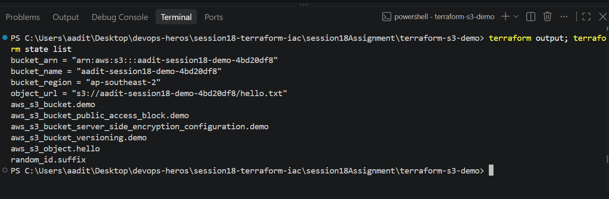
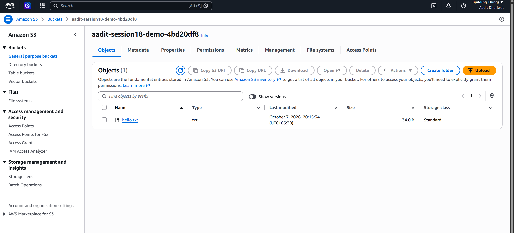
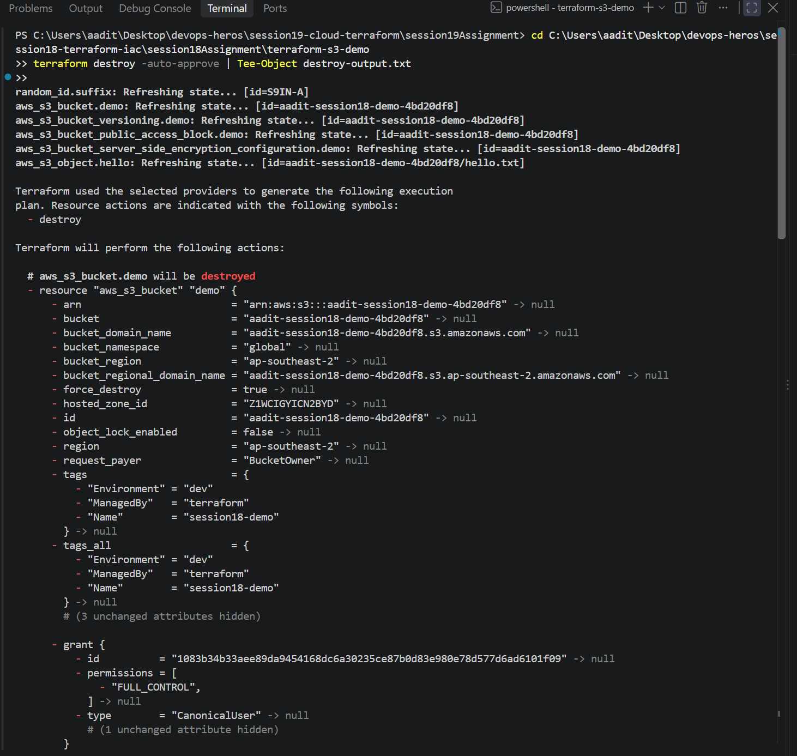

Task 1 - Terraform S3 demo

Terraform = write the infrastructure as code (.tf files), then `apply` creates it in AWS and
`destroy` deletes it. Here I made one S3 bucket. Full terminal output in workflow-output.txt.

```
provider.tf        which providers (aws, random) + region
variables.tf       region, bucket_prefix, environment
terraform.tfvars   my values for those variables
main.tf            the bucket + versioning + encryption + public access block + a hello.txt file
outputs.tf         prints bucket name, arn, region at the end
```

Bucket names have to be unique across all of AWS, so `random_id` adds a suffix
(`aadit-session18-demo-4bd20df8`). The keys come from `aws configure`, they're not in any file.

## Getting AWS working (took longer than the terraform part)

First apply failed with:

```
Error: creating S3 Bucket: ... AccessDenied: User: ...terraform-student is not authorized to perform:
s3:CreateBucket ... with an explicit deny in a service control policy
```

My account is on AWS's new "Projects" setup - every project is an AWS account with guardrails,
and my project only allows its own region, **Sydney (ap-southeast-2)**. Every other region gets
denied by the organization policy (SCP), and an SCP beats any IAM permission I give my user.
Found the region under settings.aws.com > Projects > my project > Additional info. Changed
`region` to ap-southeast-2 and it worked.

## The workflow

```
$ terraform init
Initializing provider plugins...
- Installed hashicorp/aws v6.67.0 (signed by HashiCorp)
- Installed hashicorp/random v3.9.1 (signed by HashiCorp)
Terraform has been successfully initialized!

$ terraform fmt                 (no output = already formatted)

$ terraform validate
Success! The configuration is valid.

$ terraform plan -out=tfplan
  # aws_s3_bucket.demo will be created
  + resource "aws_s3_bucket" "demo" {
      + force_destroy = true
      + region        = "ap-southeast-2"
      ...
Plan: 6 to add, 0 to change, 0 to destroy.

$ terraform apply tfplan
aws_s3_bucket.demo: Creation complete after 11s [id=aadit-session18-demo-4bd20df8]
aws_s3_object.hello: Creation complete after 2s [id=aadit-session18-demo-4bd20df8/hello.txt]
aws_s3_bucket_versioning.demo: Creation complete after 3s
aws_s3_bucket_server_side_encryption_configuration.demo: Creation complete after 2s
aws_s3_bucket_public_access_block.demo: Creation complete after 4s
Apply complete! Resources: 6 added, 0 changed, 0 destroyed.

$ terraform show
# aws_s3_bucket.demo:
resource "aws_s3_bucket" "demo" {
    arn           = "arn:aws:s3:::aadit-session18-demo-4bd20df8"
    bucket        = "aadit-session18-demo-4bd20df8"
    bucket_region = "ap-southeast-2"
    ...

$ terraform output
bucket_arn = "arn:aws:s3:::aadit-session18-demo-4bd20df8"
bucket_name = "aadit-session18-demo-4bd20df8"
bucket_region = "ap-southeast-2"
object_url = "s3://aadit-session18-demo-4bd20df8/hello.txt"
```

Checked it with the aws cli too:

```
$ aws s3 cp s3://aadit-session18-demo-4bd20df8/hello.txt -
Hello from Terraform - session 18
$ aws s3api get-bucket-versioning --bucket aadit-session18-demo-4bd20df8
{ "Status": "Enabled" }
$ aws s3api get-bucket-encryption ...
{ "SSEAlgorithm": "AES256" }
```




## Destroy

DESTROY_PLACEHOLDER



---

What I learned: `plan` shows exactly what will change before anything happens, `apply` does it,
and terraform remembers what it made in terraform.tfstate (that's how `destroy` knows what to
delete - never commit it). One S3 bucket was actually 5 resources, because versioning,
encryption etc. are separate resources in the aws provider. And an org SCP overrides IAM -
my user had S3 full access and still got denied.
