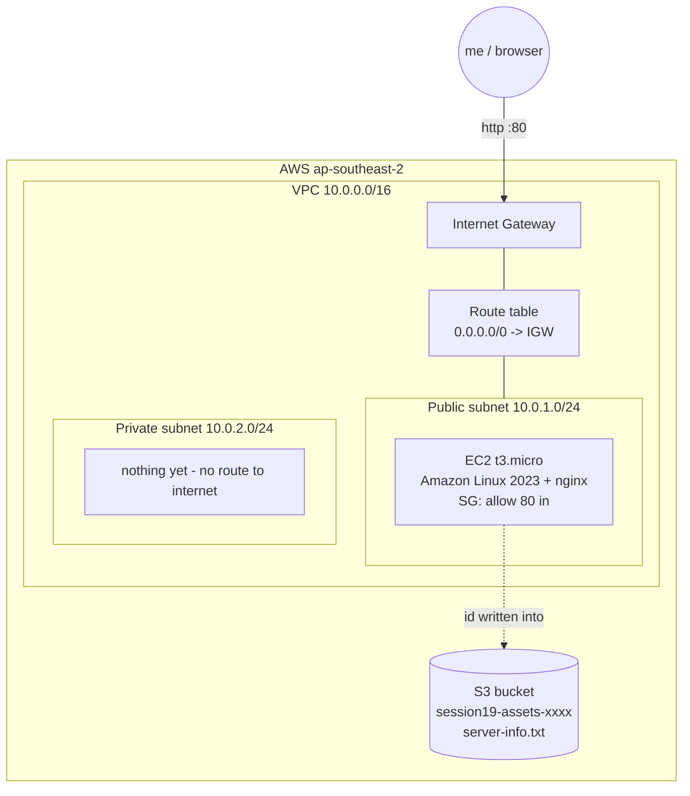
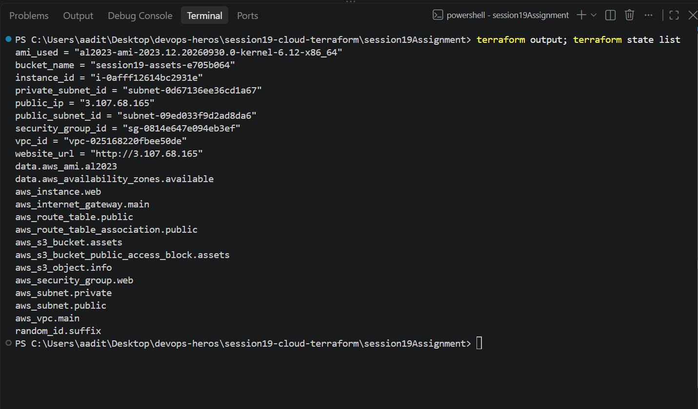
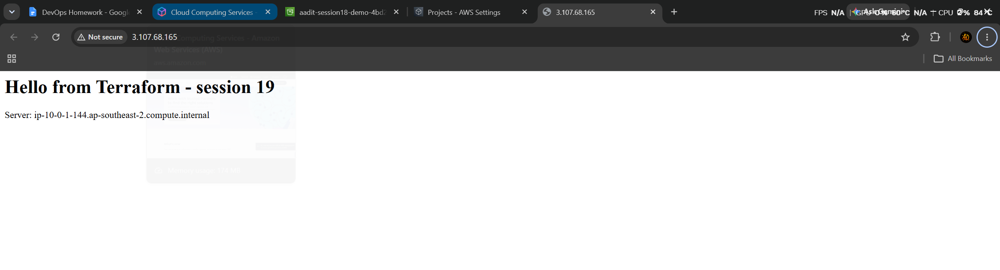
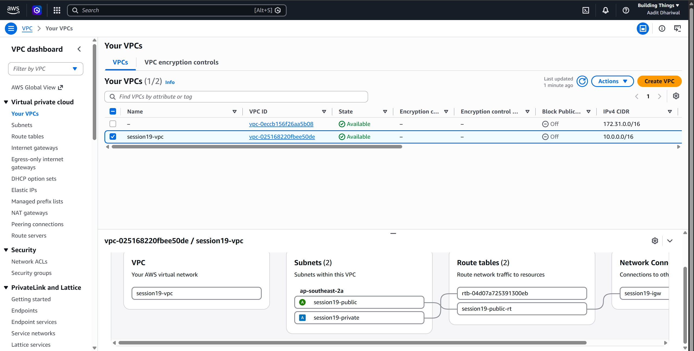
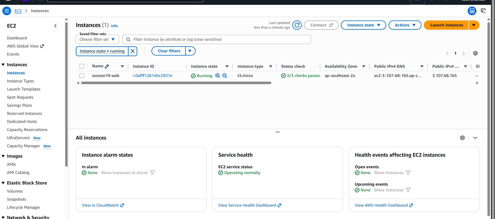
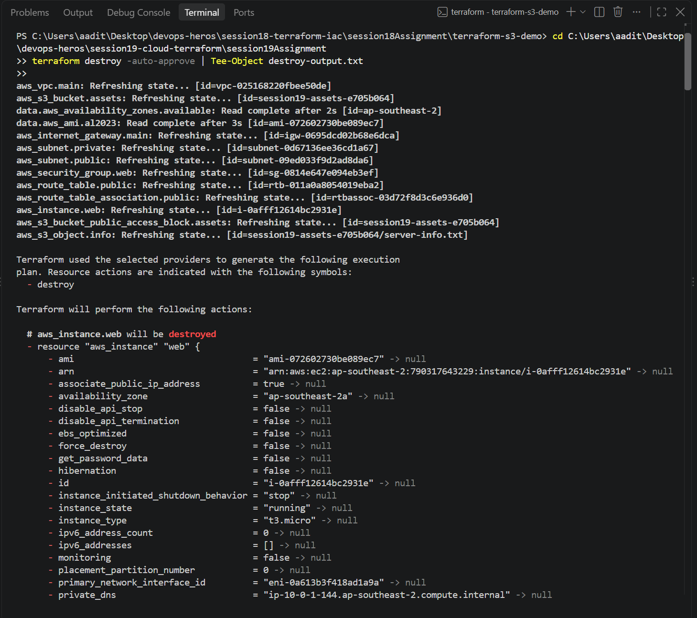

Session 19 - Cloud & Terraform in Action

Built a small AWS setup with Terraform: VPC, public + private subnet, internet gateway, route
table, security group, an EC2 running nginx, and an S3 bucket. Region is Sydney
(ap-southeast-2) because my AWS project only allows that region (see session 18 README).
Full terminal output in workflow-output.txt.

## Architecture



```
Terraform
  ├── VPC 10.0.0.0/16
  │     ├── Internet Gateway
  │     ├── Route table (0.0.0.0/0 -> IGW) ── associated with public subnet
  │     ├── Public subnet 10.0.1.0/24 ── EC2 t3.micro (nginx) + Security Group (port 80)
  │     └── Private subnet 10.0.2.0/24
  └── S3 bucket (+ public access block + server-info.txt)
```

## Files

```
versions.tf    providers (aws, random) + default_tags put on every resource
variables.tf   region, project, CIDRs, instance type - all have defaults
main.tf        2 data sources + 12 resources
outputs.tf     ids, public ip, website url, bucket name
```

How it covers the topics:
- **Providers** - `hashicorp/aws ~> 6.0` and `hashicorp/random`
- **Variables** - `var.vpc_cidr`, `var.instance_type`... nothing hardcoded in main.tf
- **Resources** - 12 of them, plus 2 **data sources** that only read: latest Amazon Linux 2023
  AMI and the list of AZs
- **Outputs** - `website_url`, `public_ip`, ids
- **Dependencies** - implicit: `vpc_id = aws_vpc.main.id` makes terraform create the VPC first.
  Explicit: the EC2 has `depends_on = [aws_route_table_association.public]` because it runs
  `dnf install nginx` on boot and needs internet straight away, but nothing in it references the route.
  The S3 file uses the instance id, so S3 object waits for the EC2.
- **State** - terraform.tfstate keeps the real ids of everything (gitignored, it has my account details)

## Commands

```
$ terraform init
- Installed hashicorp/random v3.9.1 (signed by HashiCorp)
- Installed hashicorp/aws v6.67.0 (signed by HashiCorp)
Terraform has been successfully initialized!

$ terraform validate
Success! The configuration is valid.

$ terraform plan -out=tfplan
Plan: 12 to add, 0 to change, 0 to destroy.

$ terraform apply tfplan
random_id.suffix: Creation complete after 0s [id=5wWwZA]
aws_vpc.main: Creation complete after 10s [id=vpc-025168220fbee50de]
aws_subnet.private: Creation complete after 2s [id=subnet-0d67136ee36cd1a67]
aws_internet_gateway.main: Creation complete after 3s [id=igw-0695dcd02b68e6dca]
aws_s3_bucket.assets: Creation complete after 13s [id=session19-assets-e705b064]
aws_route_table.public: Creation complete after 3s [id=rtb-011a0a8054019eba2]
aws_security_group.web: Creation complete after 6s [id=sg-0814e647e094eb3ef]
aws_subnet.public: Creation complete after 14s [id=subnet-09ed033f9d2ad8da6]
aws_route_table_association.public: Creation complete after 1s [id=rtbassoc-03d72f8d3c6e936d0]
aws_instance.web: Creation complete after 17s [id=i-0afff12614bc2931e]
aws_s3_object.info: Creation complete after 2s [id=session19-assets-e705b064/server-info.txt]
Apply complete! Resources: 12 added, 0 changed, 0 destroyed.
```

You can see the dependency order in the apply: VPC first, then IGW/subnets/SG (all need the
vpc id), route table after the IGW, EC2 only after the route association, S3 object last.

```
$ terraform output
ami_used = "al2023-ami-2023.12.20260930.0-kernel-6.12-x86_64"
bucket_name = "session19-assets-e705b064"
instance_id = "i-0afff12614bc2931e"
public_ip = "3.107.68.165"
security_group_id = "sg-0814e647e094eb3ef"
vpc_id = "vpc-025168220fbee50de"
website_url = "http://3.107.68.165"

$ terraform state list
data.aws_ami.al2023
data.aws_availability_zones.available
aws_instance.web
aws_internet_gateway.main
aws_route_table.public
aws_route_table_association.public
aws_s3_bucket.assets
aws_s3_bucket_public_access_block.assets
aws_s3_object.info
aws_security_group.web
aws_subnet.private
aws_subnet.public
aws_vpc.main
random_id.suffix

$ curl http://3.107.68.165
<h1>Hello from Terraform - session 19</h1><p>Server: ip-10-0-1-144.ap-southeast-2.compute.internal</p>
```

The page loaded about 12 seconds after apply finished (nginx install from user_data).
The server's private IP is 10.0.1.144, inside the public subnet's 10.0.1.0/24.

```
$ aws ec2 describe-subnets ... --output table
|  session19-private |  10.0.2.0/24 |  ap-southeast-2a  |  False |
|  session19-public  |  10.0.1.0/24 |  ap-southeast-2a  |  True  |
```






## Destroy

Output in destroy-output.txt.

```
$ terraform destroy -auto-approve
aws_instance.web: Destruction complete after 21s
aws_route_table_association.public: Destruction complete after 2s
aws_security_group.web: Destruction complete after 3s
aws_subnet.public: Destruction complete after 2s
aws_route_table.public: Destruction complete after 2s
aws_internet_gateway.main: Destruction complete after 2s
aws_vpc.main: Destruction complete after 1s
Destroy complete! Resources: 12 destroyed.

$ aws ec2 describe-vpcs --filters Name=tag:Project,Values=session19 --query 'length(Vpcs)'
0
```

Exact reverse of the apply - EC2 first, VPC last, because the VPC can't be deleted while
anything is still inside it.



---

What I learned: terraform figures out the order by itself from the references between
resources, `depends_on` is only for hidden dependencies. A subnet is "public" only because
of the route to the internet gateway. And the state file is how terraform knows what it owns -
`destroy` removed all 12 things in the right reverse order without me listing anything.
