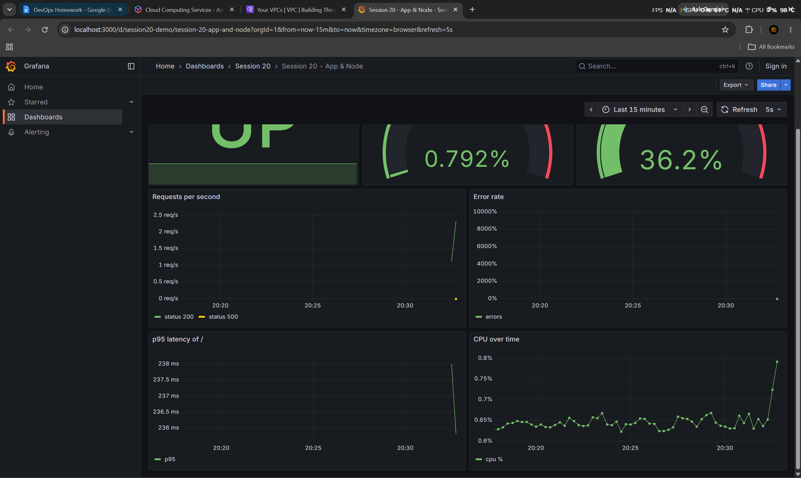
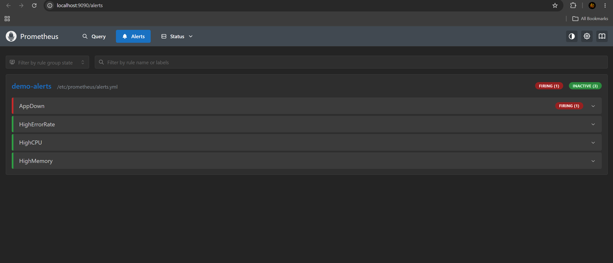

Task 1 - Monitoring demo

Prometheus + Grafana stack in docker compose, watching a small Flask app and the machine.
Full output in output.txt.

```
app            flask, exposes /metrics (request count + latency), /health, /error
node-exporter  cpu / memory / disk of the machine
prometheus     scrapes app + node every 5s, evaluates alerts.yml
grafana        dashboard "Session 20 - App & Node" loaded automatically (provisioning/)
```

Run it:

```
docker compose up -d --build
app         http://localhost:5000
prometheus  http://localhost:9090   (Status > Targets, Alerts)
grafana     http://localhost:3000   (Dashboards > Session 20)
```

## Metrics

The app counts its own requests, prometheus pulls them from /metrics:

```
$ curl -s localhost:5000/metrics | grep app_requests_total
app_requests_total{path="/",status="200"} 200.0
```

Queries I used (same ones are the grafana panels):

```
up                                      app 1, node 1, prometheus 1     <- application health
CPU utilization %     100 - (avg(rate(node_cpu_seconds_total{mode="idle"}[1m])) * 100)          => 13.2
Memory utilization %  (1 - node_memory_MemAvailable_bytes / node_memory_MemTotal_bytes) * 100    => 31.9
requests/sec          sum by (status) (rate(app_requests_total[1m]))                             => 3.38
p95 latency of /      histogram_quantile(0.95, sum by (le) (rate(app_request_seconds_bucket{path="/"}[1m]))) => 0.236s
```

(cpu/memory are of the Docker Desktop VM, not my whole windows pc - node-exporter runs inside it)



## Logs

Metrics tell me something is wrong, logs tell me what:

```
$ docker compose logs app --tail 3
2026-10-07 13:25:20,001 INFO GET / 200
2026-10-07 13:25:20,036 ERROR GET /error 500 - something broke
```

## Alerts

4 rules in alerts.yml: AppDown, HighErrorRate (>10%), HighCPU (>80%), HighMemory (>90%).
An alert goes inactive -> pending (condition true, waiting for `for:`) -> firing.

Demo 1 - sent traffic where 1 in 3 requests hit /error:

```
after ~25s   HighErrorRate pending - error rate is 13.26%
after ~55s   HighErrorRate firing  - error rate is 31.75%
```

Demo 2 - stopped the app:

```
$ docker compose stop app
up{job="app"} => 0
AppDown firing - the app is down

$ docker compose start app
up{job="app"} => 1          <- AppDown gone
```

HighErrorRate stayed firing a bit after because it looks at the last 1 minute of data.



In real life alertmanager would send these to slack/email, I only did the prometheus side.

What I learned: metrics are just numbers over time that prometheus pulls, PromQL turns them
into things like cpu %. CPU% is "100 - idle%". An alert needs `for:` so one bad scrape doesn't
page someone. And the app has to expose /metrics itself, prometheus doesn't magically know.
