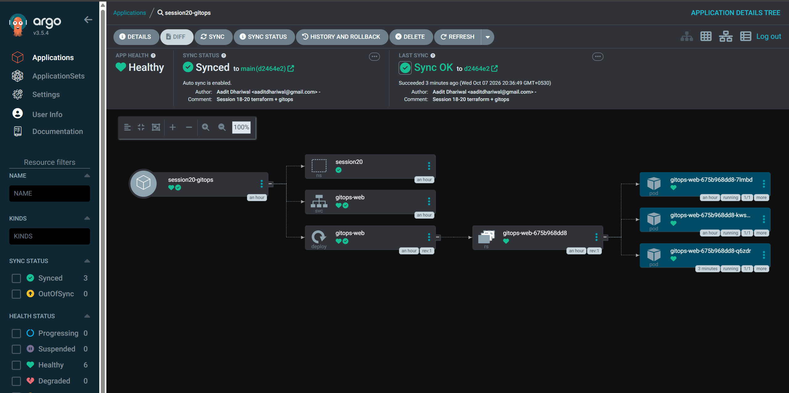

Task 3 - GitOps with Argo CD

GitOps = git is the source of truth for what runs in the cluster. I don't `kubectl apply` my
app - I change yaml in git, and Argo CD (running inside the cluster) keeps the cluster equal
to git. Full output in output.txt.

```
app/namespace.yaml           session20 namespace
app/deployment.yaml          nginx, replicas from git
app/service.yaml
argocd-application.yaml      tells argo: watch THIS repo + folder, deploy into session20
```

argocd-application.yaml is outside app/ on purpose - otherwise argo would be managing its own config.

Ideas from the session, in my words:
- **Declarative** - the yaml says *what* I want (2 replicas of nginx), not the steps to get there.
- **Git as source of truth** - if it's not in git it shouldn't be in the cluster. Every change is a
  commit, so I get history, review and `git revert` as rollback for free.
- **Continuous reconciliation** - argo keeps comparing cluster vs git (every ~3 min + on changes)
  and fixes differences. That's the "pull" model - the cluster pulls from git, CI never needs cluster access.
- **Workflow**: edit yaml -> commit -> push -> argo notices -> syncs -> cluster matches git.

## Setup

Installed Argo CD v3.5.4 on minikube:

```
kubectl create namespace argocd
kubectl apply -n argocd --server-side -f https://raw.githubusercontent.com/argoproj/argo-cd/v3.5.4/manifests/install.yaml
```

## 1. First sync

```
$ kubectl apply -f argocd-application.yaml
application.argoproj.io/session20-gitops created

$ kubectl get application session20-gitops -n argocd
NAME               SYNC STATUS   HEALTH STATUS
session20-gitops   Synced        Healthy

$ kubectl get all -n session20
pod/gitops-web-675b968dd8-7lmbd   1/1     Running   0          14s
pod/gitops-web-675b968dd8-kws8b   1/1     Running   0          14s
service/gitops-web   ClusterIP   10.109.186.194   <none>        80/TCP    15s
deployment.apps/gitops-web   2/2     2            2           15s
```

I never applied app/ myself - argo pulled it from my github repo.

## 2. Self-heal - someone changes the cluster by hand

```
$ kubectl scale deploy gitops-web -n session20 --replicas=5

$ kubectl get deploy gitops-web -n session20 -w
gitops-web   2/2     2            2           36s
gitops-web   2/5     2            2           38s     <- my manual change
gitops-web   2/5     5            2           38s
gitops-web   2/2     5            2           38s     <- argo puts it back to 2
gitops-web   2/2     2            2           39s
```

Reverted in about a second, because git still says 2.

## 3. Self-heal - someone deletes something

```
$ kubectl delete svc gitops-web -n session20
$ kubectl get svc -n session20 -w
gitops-web   ClusterIP   10.110.108.37   <none>        80/TCP    28s
gitops-web   ClusterIP   10.111.61.246   <none>        80/TCP    0s     <- recreated by argo
```

## 4. The proper way - change it in git

GIT_CHANGE_PLACEHOLDER



---

What I learned: with GitOps the cluster stops being something people poke at with kubectl,
manual changes just get undone. To change anything you go through git, which means every change
is reviewed and has history. Argo is just a controller that runs a loop: compare git vs cluster, fix.
