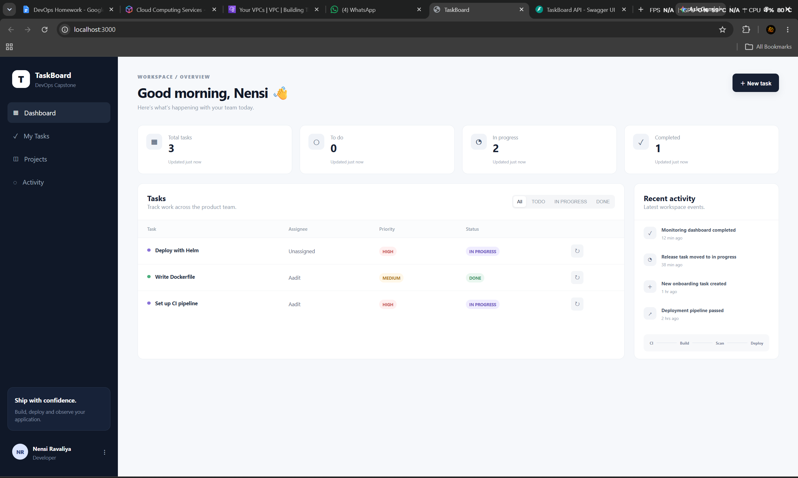
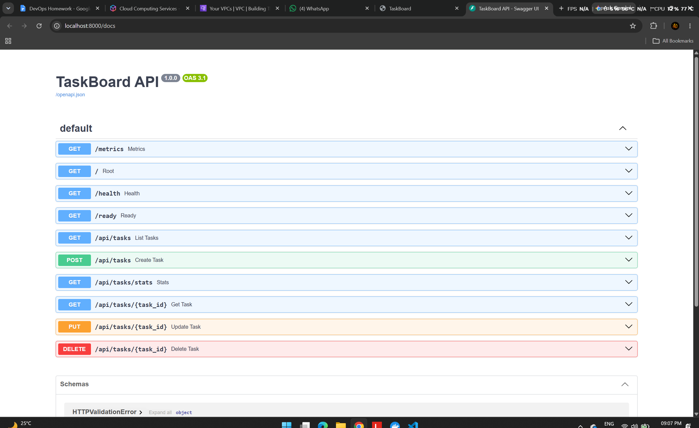
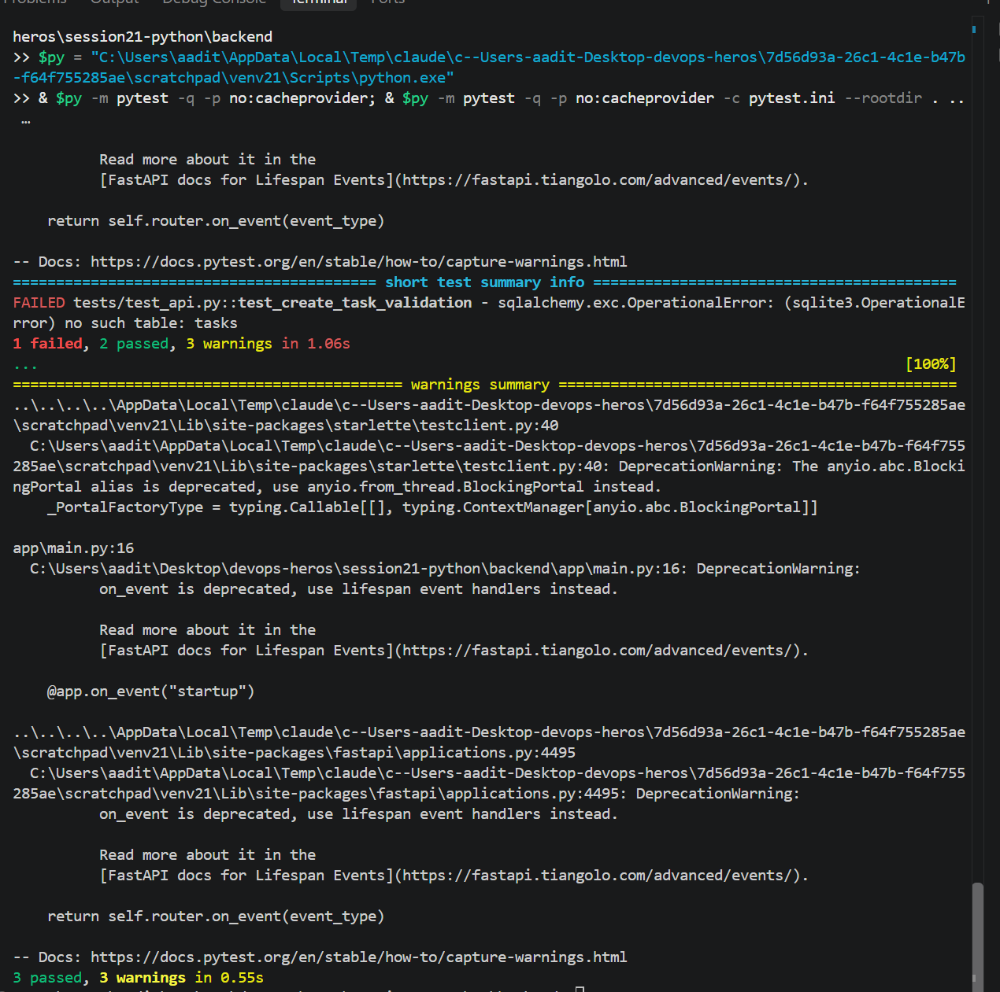
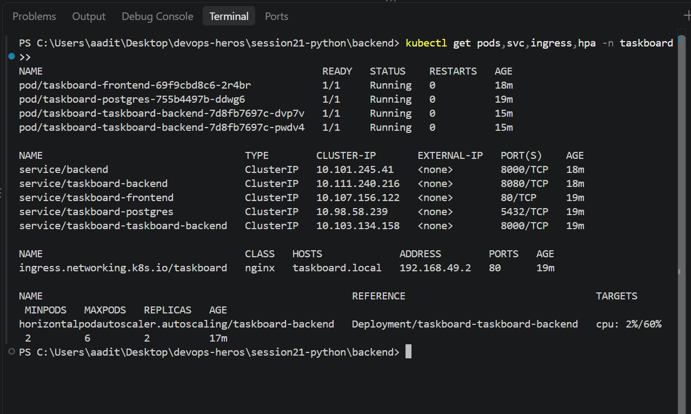
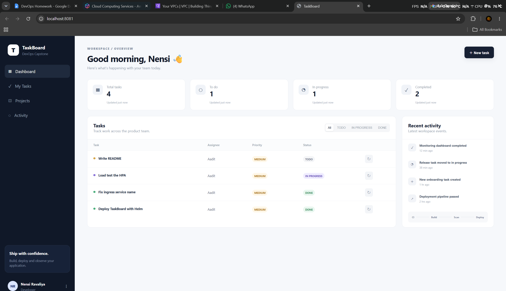
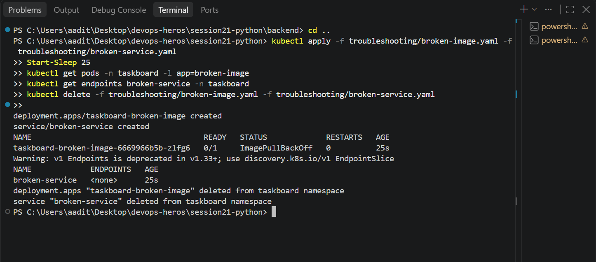

Session 21 - TaskBoard capstone (Python)

Ran the TaskBoard project from session21-python following its README: docker compose, pytest,
trivy, helm on minikube (ingress + HPA), the troubleshooting lab, and terraform validate.
Found a few bugs in the provided files along the way - fixes are in this folder, I didn't
edit the original files. Raw output in the numbered .txt files.

```
React frontend (nginx) --/api--> FastAPI backend --> PostgreSQL
                                     /health /ready /metrics
```

## 1. Docker compose (01-docker-compose-output.txt)

```
$ docker compose up --build
```

Backend crashed on the first start:

```
sqlalchemy.exc.OperationalError: connection to server at "172.20.0.2", port 5432 failed: Connection refused
```

`depends_on` only waits for the postgres *container* to start, not for postgres to be ready, so
`alembic upgrade head` ran too early. `docker compose up -d backend` again and it was fine.
(Proper fix would be a healthcheck on postgres + `condition: service_healthy`.)

```
$ curl localhost:8000/health
{"status":"UP"}
$ curl localhost:8000/ready
{"status":"READY"}                                  <- this one actually queries the db
$ curl -X POST localhost:8000/api/tasks -d '{"title":"Set up CI pipeline","priority":"HIGH","assignee":"Aadit"}'
{"title":"Set up CI pipeline","priority":"HIGH","status":"TODO","assignee":"Aadit","id":1,...}
$ curl -X PUT localhost:8000/api/tasks/1 -d '{"status":"IN_PROGRESS"}'
$ curl -X DELETE localhost:8000/api/tasks/4          -> 204
$ curl -X POST localhost:8000/api/tasks -d '{"title":""}'
{"detail":[{"type":"string_too_short","loc":["body","title"],"msg":"String should have at least 1 character"...}]}
$ curl localhost:8000/api/tasks/stats
{"total":3,"todo":0,"inProgress":2,"done":1}
$ curl localhost:3000/api/tasks                      <- same data through the frontend's nginx
$ curl localhost:8000/metrics | grep http_requests_total
http_requests_total{handler="/api/tasks",method="POST",status="2xx"} 4.0
http_requests_total{handler="/api/tasks",method="POST",status="4xx"} 1.0
$ docker compose exec postgres psql -U taskboard -c "select id,title,status,priority from tasks"
  2 | Write Dockerfile   | DONE        | MEDIUM
  3 | Deploy with Helm   | IN_PROGRESS | HIGH
  1 | Set up CI pipeline | IN_PROGRESS | HIGH
```




## 2. Pytest (02-pytest-output.txt)

```
$ cd backend && pytest -q
FAILED tests/test_api.py::test_create_task_validation - ... no such table: tasks
1 failed, 2 passed
```

The app creates its tables in `@app.on_event("startup")`, but the test makes `TestClient(app)`
without a `with` block, so startup never runs and the sqlite db has no tables. The two passing
tests just never touch the db. Fixed copy in test_api_fixed.py:

```
$ pytest ../session21Assignment/test_api_fixed.py
::test_health PASSED
::test_root PASSED
::test_create_task_validation PASSED
3 passed
```

So the CI pipeline in .github/workflows/ci-cd.yml (runs `pytest -q`) would actually fail at the first gate.



## 3. Trivy (03-trivy-output.txt)

Same settings as the pipeline: HIGH,CRITICAL, ignore-unfixed, exit-code 1.

```
session21-python-backend    Total: 3 (HIGH: 3)      starlette 0.41.3 -> fixed in 0.49.1   exit code: 1
session21-python-frontend   Total: 44 (HIGH: 42, CRITICAL: 2)   alpine 3.21.3 base packages (openssl, musl, zlib...)   exit code: 1
```

Both would fail the security gate. Backend needs a newer fastapi/starlette, frontend needs a newer nginx base image.

## 4. Kubernetes + Helm on minikube (04-k8s-output.txt)

Built the images locally, loaded them into minikube and installed the chart like the README says
(only swapped the image names, and turned off the ServiceMonitor because Prometheus Operator isn't installed):

```
$ minikube image load taskboard-backend:local ; minikube image load taskboard-frontend:local
$ kubectl apply -f k8s/namespace.yaml
$ helm upgrade --install taskboard ./helm/taskboard -n taskboard -f helm/taskboard/values-dev.yaml \
    --set backend.image=taskboard-backend --set backend.tag=local \
    --set frontend.image=taskboard-frontend --set frontend.tag=local \
    --set monitoring.serviceMonitor.enabled=false

$ kubectl get pods -n taskboard
taskboard-frontend-bbb7b895f-rgkfx             0/1     Error     3 (33s ago)   60s
taskboard-postgres-755b4497b-ddwg6             1/1     Running   0             60s
taskboard-taskboard-backend-7d8fb7697c-vhkm2   1/1     Running   3 (44s ago)   60s
```

Three problems:

```
$ kubectl logs -n taskboard deploy/taskboard-frontend
nginx: [emerg] host not found in upstream "backend" in /etc/nginx/conf.d/default.conf:13

$ kubectl describe ingress taskboard -n taskboard
  /api   taskboard-backend:8080 (<error: services "taskboard-backend" not found>)
```

1. frontend - nginx.conf proxies to `backend:8000`, that name only exists in docker compose. In k8s nginx won't even start.
2. ingress - points at `taskboard-backend:8080`, but the chart names the service
   `{release}-taskboard-backend` (= `taskboard-taskboard-backend`) on port 8000.
3. backend restarted 3 times - same postgres-not-ready race as compose, but here k8s just
   restarted it until it worked.

Fix: k8s-fixes.yaml adds a `backend` service and a `taskboard-backend` service (8080 -> 8000), then restart the frontend:

```
$ kubectl apply -f session21Assignment/k8s-fixes.yaml
$ kubectl get pods -n taskboard
taskboard-frontend-69f9cbd8c6-2r4br            1/1     Running   0             16s
taskboard-postgres-755b4497b-ddwg6             1/1     Running   0             96s
taskboard-taskboard-backend-7d8fb7697c-vhkm2   1/1     Running   3 (80s ago)   96s
$ kubectl describe ingress taskboard -n taskboard
  /api   taskboard-backend:8080 (10.244.0.138:8000)
```

Ingress test - taskboard.local isn't in my hosts file, so ingress-test.py calls the ingress
controller from inside the cluster with `Host: taskboard.local`:

```
POST /api/tasks (201, '{"title":"Deploy TaskBoard with Helm",...,"status":"DONE"...}')
GET  /api/tasks/stats (200, '{"total":4,"todo":1,"inProgress":1,"done":2}')
GET  / 200 <!doctype html><html><head>...                <- / goes to the react frontend
```




### HPA

values-dev.yaml has `hpa.enabled: false`, so `helm upgrade ... --set hpa.enabled=true` (revision 2).
scripts/load-test.sh is only 500 curls, so I used load-generator.yaml (6 busybox pods looping on /api/tasks):

```
$ kubectl get hpa -n taskboard -w
taskboard-backend   Deployment/taskboard-taskboard-backend   cpu: 8%/60%     2   6   2
taskboard-backend   Deployment/taskboard-taskboard-backend   cpu: 343%/60%   2   6   2
taskboard-backend   Deployment/taskboard-taskboard-backend   cpu: 343%/60%   2   6   4
taskboard-backend   Deployment/taskboard-taskboard-backend   cpu: 343%/60%   2   6   6     <- max
taskboard-backend   Deployment/taskboard-taskboard-backend   cpu: 159%/60%   2   6   6
```

Still 159% at 6 pods but maxReplicas is 6, so it can't go further.

## 5. Troubleshooting lab

```
$ kubectl apply -f troubleshooting/broken-image.yaml
$ kubectl get pods -n taskboard -l app=broken-image
taskboard-broken-image-6669966b5b-jhvvw   0/1     ImagePullBackOff   0          25s
$ kubectl describe pod ...
  Failed to pull image "ghcr.io/example/taskboard-backend:does-not-exist" ... Error: ErrImagePull
```
Root cause: the image/tag doesn't exist. Fix: point it at a real image.

```
$ kubectl apply -f troubleshooting/broken-service.yaml
$ kubectl get endpoints broken-service backend -n taskboard
broken-service   <none>
backend          10.244.0.138:8000,10.244.0.142:8000,10.244.0.149:8000 + 3 more...
```
Root cause: selector `app: label-that-does-not-exist` matches no pod labels (`kubectl get pods --show-labels`).
Same lesson as my ingress fix - services find pods only by labels/names.



## 6. Terraform (05-terraform-output.txt)

The terraform folder makes a VPC + NAT gateway + EKS cluster (2x t3.medium). I did NOT apply
it - EKS and NAT cost money even on the free plan, and my AWS project only allows Sydney anyway.
`init` didn't even work:

```
$ terraform init
Error: Invalid single-argument block definition
  on main.tf line 1, in module "vpc":
   1: module "vpc" { source = "terraform-aws-modules/vpc/aws" version = "5.8.1" name = ...
```

Every block is written on one line, and terraform only allows that with a single argument.
terraform-fixed/ is the same config with one argument per line:

```
$ terraform fmt -check     (already formatted)
$ terraform init
Downloading registry.terraform.io/terraform-aws-modules/vpc/aws 5.8.1 for vpc...
Downloading registry.terraform.io/terraform-aws-modules/eks/aws 20.37.1 for eks...
Terraform has been successfully initialized!
$ terraform validate
Success! The configuration is valid.
```

---

What I learned: "it works in docker compose" doesn't mean it works in k8s - names like
`backend` come from compose, and k8s service names come from the helm template. `depends_on`
isn't a readiness check. Running the tests and scanners locally first would have caught that
this pipeline fails at pytest and again at trivy before anything got pushed.
