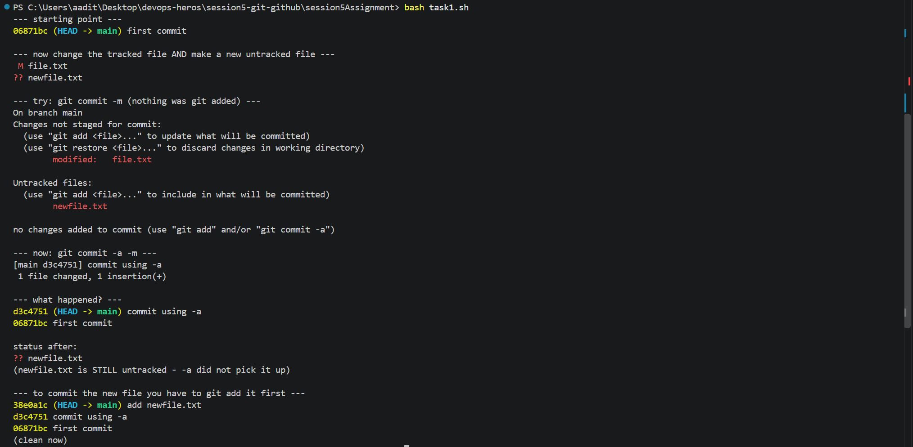
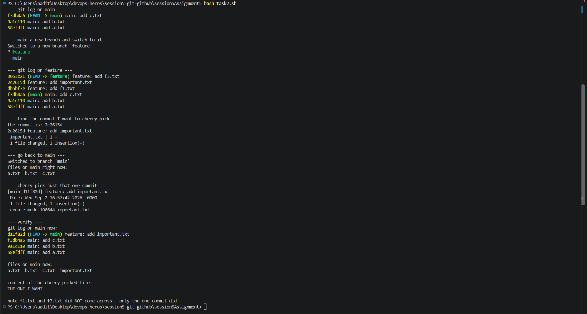

# Session 5 - Git tasks

Ran both tasks in a throwaway repo (git init) so the real repo history stays clean.
Scripts are task1.sh and task2.sh.

---

## Task 1: git commit -m vs git commit -a -m

What I understood:

Made one commit, then changed the tracked file (file.txt) and also made a new file
(newfile.txt). Status showed ` M file.txt` and `?? newfile.txt`.

`git commit -m` refused - "no changes added to commit". Nothing was staged so there
was nothing to commit.

`git commit -a -m` worked without git add, but it said **1 file changed**. After it,
newfile.txt was still `??` untracked. So -a only stages files git is already tracking,
it does not pick up new files.

To get newfile.txt in I had to `git add` it first, then commit normally.

---

## Task 2: Cherry-pick

What I understood:

Made 3 commits on main (58efdff, 9a1c110, f3db4a6), then made a feature branch and did
3 more commits on it (db5bf7e, 2c2615d, 3053c21).

Used git log to find the one I wanted - 2c2615d "feature: add important.txt".

Switched back to main (only a.txt b.txt c.txt there), then `git cherry-pick 2c2615d`.

After that main had important.txt with the right content, but f1.txt and f3.txt did
NOT come across. Only the one commit I picked.

The hash also changed - 2c2615d on feature became d11f82d on main. So cherry-pick
copies the changes into a brand new commit, it doesn't move the original one.
