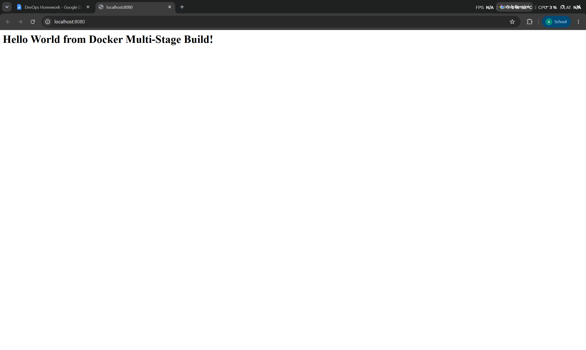
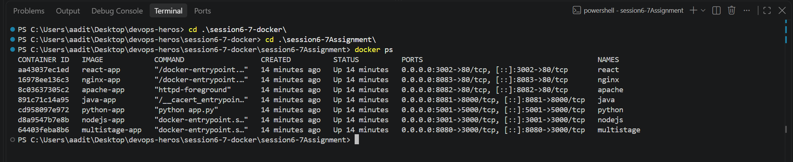

# Docker Multi-Stage Build - Documentation

**Name:** Aadit Dhariwal

**Enrollment / Roll Number:** 24BCS10169

---

## Task 1: Multi-stage Dockerfile

The multi-stage Dockerfile is in `multistage-app/`. Stage 1 (`builder`) installs all
dependencies, stage 2 (`production`) starts fresh and copies only what it needs, then
runs `npm install --omit=dev` so dev dependencies never end up in the final image.

Built and ran it, mapping container port 3000 to host port 8080:

```
docker build -t multistage-app multistage-app
docker run -d --name multistage -p 8080:3000 multistage-app
```

### Application running on port 8080



Output from the terminal:

```
$ curl http://localhost:8080
<h1>Hello World from Docker Multi-Stage Build!</h1>
```

### docker ps showing the container on port 8080



```
$ docker ps
NAMES        IMAGE            PORTS                                         STATUS
multistage   multistage-app   0.0.0.0:8080->3000/tcp, [::]:8080->3000/tcp   Up 40 seconds
```

Confirmed running on port 8080.

---

## Task 3: Deploying 3+ different application types

Deployed 7 containers of 6 different types. All returned HTTP 200 with Hello World:

| App | Image | Port | Result |
|---|---|---|---|
| Node.js | nodejs-app | 3001 | Hello World from Node.js! |
| Python (Flask) | python-app | 5001 | Hello World from Python! |
| Java | java-app | 8081 | Hello World from Java! |
| Apache | apache-app | 8082 | Hello World from Apache! |
| Nginx | nginx-app | 8083 | Hello World from Nginx! |
| React | react-app | 3002 | Hello World from React! |
| Multi-stage Node | multistage-app | 8080 | Hello World from Docker Multi-Stage Build! |

```
$ docker ps
NAMES        IMAGE            PORTS                                         STATUS
react        react-app        0.0.0.0:3002->80/tcp                          Up
nginx        nginx-app        0.0.0.0:8083->80/tcp                          Up
apache       apache-app       0.0.0.0:8082->80/tcp                          Up
java         java-app         0.0.0.0:8081->8000/tcp                        Up
python       python-app       0.0.0.0:5001->5000/tcp                        Up
nodejs       nodejs-app       0.0.0.0:3001->3000/tcp                        Up
multistage   multistage-app   0.0.0.0:8080->3000/tcp                        Up
```

Full curl output for every app is in `output.txt`.
