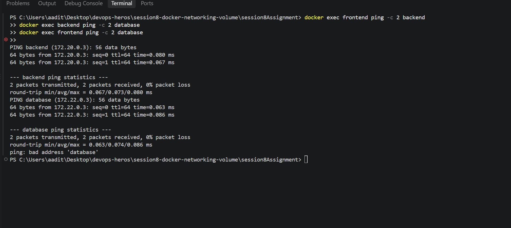
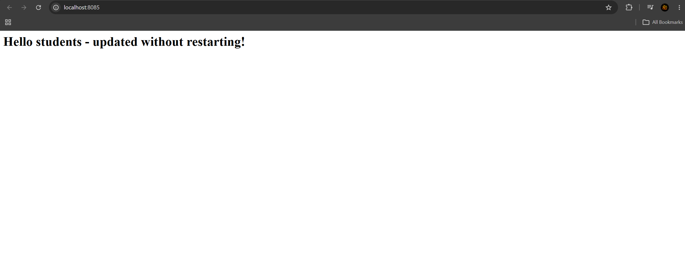
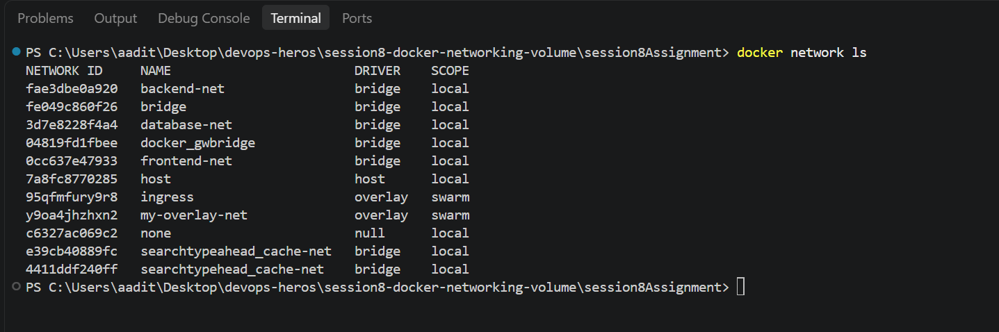

Session 8 - Docker networking and volumes

Four tasks: container networking with 3 networks, host network, bind mount, and
overlay networks. Raw output for each is in task1-networking.txt,
task2-hostnetwork.txt, task3-bindmount.txt and task4-overlay.txt.

---

## Task 1: Container networking

Made 3 networks and 3 containers. Backend is on 2 networks (frontend-net and
database-net) so it can talk to both sides, frontend and database are on one each.

```
frontend   -> frontend-net
backend    -> database-net frontend-net
database   -> database-net
```



Connectivity tests:

```
$ docker exec frontend ping -c 2 backend
64 bytes from 172.20.0.3: seq=0 ttl=64 time=1.101 ms      <- works

$ docker exec backend ping -c 2 database
64 bytes from 172.22.0.3: seq=0 ttl=64 time=0.893 ms      <- works

$ docker exec frontend ping -c 2 database
ping: bad address 'database'                              <- fails
```

frontend can't reach database because they share no network. It doesn't even resolve
the name, so Docker's DNS only knows containers on networks you're actually on. That's
the whole point - backend is the only thing that can reach the database.

(backend-net was the third network I created. Nothing is attached to it since backend
only needed 2, but the task asked for 3 networks.)

## Task 2: Host network

```
$ docker run -d --name apache-host --network host httpd:2.4
$ docker inspect -f '{{.HostConfig.NetworkMode}}' apache-host
host
```


**Important thing I hit:** on Docker Desktop for Windows, `--network host` does NOT
mean my Windows machine. Docker Desktop runs the engine inside a Linux VM, so "host"
is that VM. Apache really was serving on port 80, but only inside the VM:

```
$ docker run --rm --network host alpine curl -s http://localhost:80
<title>It works! Apache httpd</title>
```

From Windows, curl to localhost:80 got nothing. To actually see it in a browser I ran
it with a port mapping instead:

```
$ docker run -d --name apache-port -p 80:80 httpd:2.4
$ curl http://localhost:80
HTTP 200
```

On a real Linux host, `--network host` would have worked directly with no mapping.

## Task 3: Bind mount

Made a `website` folder with index.html saying "Hello students" and mounted it in:

```
docker run -d --name nginx-bind -p 8085:80 \
  -v <full path>/website:/usr/share/nginx/html nginx:alpine
```



```
$ curl http://localhost:8085
<h1>Hello students</h1>

# edited index.html on my machine, did NOT touch the container
$ curl http://localhost:8085
<h1>Hello students - updated without restarting!</h1>
```

The change showed up straight away. Proved it never restarted by checking the start
time before and after - same both times (2026-09-03T12:15:05Z).

## Task 4: Overlay networks

Overlay networks let containers on **different Docker hosts** talk to each other like
they're on the same LAN. Bridge networks only work on one machine.

Needs swarm mode, so:

```
$ docker swarm init
$ docker network create -d overlay my-overlay-net
$ docker network ls
NETWORK ID     NAME             DRIVER    SCOPE
fae3dbe0a920   backend-net      bridge    local
95qfmfury9r8   ingress          overlay   swarm
y9oa4jhzhxn2   my-overlay-net   overlay   swarm
```



The SCOPE column is the giveaway - bridge is `local` (this machine only), overlay is
`swarm` (every node in the swarm).

How it works: it wraps container traffic in VXLAN packets and sends them over the real
network between hosts, so containers get one flat virtual network even though they're
on different physical machines. Docker keeps a shared key/value store so every node
agrees on which container has which IP.

Use cases: running a service across several servers (Docker Swarm / Kubernetes style),
so a container on server A can just say `http://database` and reach a container on
server B without knowing any real IPs or ports.

`ingress` is the overlay Docker makes automatically - it's what routes published
ports to whichever node is running the container.

---

What I learned:

Docker networks aren't just plumbing, they're security. Putting the database on its
own network meant the frontend literally could not resolve it. That's a much better
default than everything being able to reach everything.

Bind mounts map a real folder into the container, so edits show up live with no
rebuild. Good for development. The container has no copy of the file - it's reading
mine directly.

Host networking is one of those things that behaves differently on Windows/Mac vs
Linux, and I only found out by testing it instead of assuming.
